---
title: |
 | A free and open source computational tool
 | for solving differential equations in the cloud
author: Jeremy Theler
email: jeremy@seamplex.com
institute: |
 | Mid-term evaluation, PhD in Nuclear Engineering
 | Instituto Balseiro, San Carlos de Bariloche, Argentina
aspectratio: 169
lang: en-US
theme: default
innertheme: rectangles
fonttheme: professionalfonts
outertheme: number
colorlinks: true
sansfont: Carlito
monofont: DejaVuSansMono
header-includes: \include{syntax.tex}
...


 


 

## How do we write papers/reports/documents?

\newcommand{\todonow}{\textcolor{Plum}{TO-DO}}
\newcommand{\todolater}{\textcolor{Orange}{TO-DO}}
\newcommand{\good}{\textcolor{OliveGreen}{$\checkmark$}}
\newcommand{\bad}{\textcolor{red}{$\times$}}
\newcommand{\neutral}{\textcolor{DarkBlue}{$\sim$}}

   
:::::::::::::: {.columns}
::: {.column width="25%"}
\centering \onslide<1->{\includegraphics[height=2cm]{word}}
:::

::: {.column width="25%"}
\centering \onslide<3->{\includegraphics[height=2cm]{google_docs}}
:::

::: {.column width="25%"}
\centering \onslide<4->{\includegraphics[height=2cm]{markdown}}
:::

::: {.column width="25%"}
\centering \onslide<2->{\includegraphics[height=2cm]{tex}}
:::
::::::::::::::

\rowcolors{1}{black!10}{black!0}

 Feature                | \onslide<1->{Word}     |   \onslide<3->{Docs}     |  \onslide<4->{Markdown$^{*}$}    |  \onslide<2->{\TeX}
:-----------------------|:----------------------:|:------------------------:|:--------------------------------:|:------------------------:
 Aesthetics             | \onslide<1->{\bad}     |   \onslide<3->{\bad}     |  \onslide<4->{\good}             |  \onslide<2->{\good}
 Convertibility         | \onslide<1->{\neutral} |   \onslide<3->{\neutral} |  \onslide<4->{\good}             |  \onslide<2->{\neutral}
 Traceability           | \onslide<1->{\bad}     |   \onslide<3->{\neutral} |  \onslide<4->{\good}             |  \onslide<2->{\good}
 Mobile-friendliness    | \onslide<1->{\bad}     |   \onslide<3->{\good}    |  \onslide<4->{\good}             |  \onslide<2->{\bad}
 Collaborative          | \onslide<1->{\bad}     |   \onslide<3->{\good}    |  \onslide<4->{\good}             |  \onslide<2->{\neutral}
 Licensing/openness     | \onslide<1->{\bad}     |   \onslide<3->{\bad}     |  \onslide<4->{\good}             |  \onslide<2->{\good}
 Non-nerd friendliness  | \onslide<1->{\good}    |   \onslide<3->{\good}    |  \onslide<4->{\neutral}          |  \onslide<2->{\bad}

\onslide<4->{\centering $^*$ \href{https://en.wikipedia.org/wiki/Markdown}{Markdown} +
\href{https://pandoc.org/}{Pandoc} + \href{https://git-scm.com/}{Git} +
\href{https://github.com/}{Github} /
\href{https://about.gitlab.com/}{Gitlab} /
\href{https://gitea.com/}{Gitea}}

 
## How do we do scientific/engineering computations?

:::::::::::::: {.columns}
::: {.column width="25%"}
\centering \onslide<1->{\includegraphics[height=2cm]{prepomax}}
:::

::: {.column width="25%"}
\centering \onslide<3->{\includegraphics[height=2cm]{caeplex}}
:::

::: {.column width="25%"}
\centering \onslide<4->{\includegraphics[height=2cm]{feenox-logo}}
:::

::: {.column width="25%"}
\centering \onslide<2->{\includegraphics[height=2cm]{libraries}}
:::
::::::::::::::

\rowcolors{1}{black!10}{black!0}

 Feature                | \onslide<1->{Desktop GUIs}         |   \onslide<3->{Web frontends} |  \onslide<4->{FeenoX$^{*}$}      |  \onslide<2->{Libraries}
:-----------------------|:----------------------------------:|:-----------------------------:|:--------------------------:|:-----------------------------:
 Flexibility            | \onslide<1->{\neutral}             |   \onslide<3->{\bad}          |  \onslide<4->{\good}       |  \onslide<2->{\good}
 Scalability            | \onslide<1->{\bad}                 |   \onslide<3->{\neutral}      |  \onslide<4->{\good}       |  \onslide<2->{\good}
 Traceability           | \onslide<1->{\bad}                 |   \onslide<3->{\neutral}      |  \onslide<4->{\good}       |  \onslide<2->{\good}
 Cloud-friendliness     | \onslide<1->{\bad}                 |   \onslide<3->{\good}         |  \onslide<4->{\good}       |  \onslide<2->{\good}
 Collaborative          | \onslide<1->{\bad}                 |   \onslide<3->{\good}         |  \onslide<4->{\neutral}    |  \onslide<2->{\bad}
 Licensing/openness     | \onslide<1->{\good/\neutral/\bad}  |   \onslide<3->{\bad}          |  \onslide<4->{\good}       |  \onslide<2->{\good}
 Non-nerd friendliness  | \onslide<1->{\good}                |   \onslide<3->{\good}         |  \onslide<4->{\neutral}    |  \onslide<2->{\bad}
 

\onslide<4->{\centering $^*$ \href{https://seamplex.com/feenox}{FeenoX} +
\href{http://gmsh.info}{Gmsh} + \href{https://www.paraview.org/}{Paraview} + \href{https://git-scm.com/}{Git} +
\href{https://github.com/}{Github} /
\href{https://about.gitlab.com/}{Gitlab} /
\href{https://gitea.com/}{Gitea}}
 
## Software Requirement Specifications

After a successful project with a foreign company I decided to structure the PhD based on
a fictitious & imaginary "Request for Quotation" for a computational tool:

:::::::::::::: {.columns}
::: {.column width="35%"}

 1. Introduction
    * 1.1. Objective
    * 1.2. Scope
 2. Architecture
    * 2.1. Deployment
    * 2.2. Execution
    * 2.3. Efficiency
    * 2.4. Scalability
    * 2.5. Flexibility
    * 2.6. Extensibility
    * 2.7. Interoperability
:::

::: {.column width="50%"}

 3. Interfaces
    * 3.1. Problem input
    * 3.2. Results output
 4. Quality assurance
    * 4.1. Reproducibility and traceability 
    * 4.2. Automated testing
    * 4.3. Bug reporting and tracking
    * 4.4. Verification
    * 4.5. Validation
    * 4.6. Documentation
:::
::::::::::::::


### FeenoX Software Design Specifications {.example}

 * A fictitious & imaginary tender applying to the SRS addressing each section.


## 

:::::::::::::: {.columns}
:::::: {.column width="50%"}

### 1. Introduction

 * Application to industrial problems
   - Open source (to allow third-party V&V)
 * First version should handle some problems
 * Extensible to other problems & formulations 
   - Free (as in freedom to hire somebody to modify/extend it)

#### 1.1. Objective

 * Solve DAEs and/or PDEs
    - Heat conduction
    - Elasticity
    - Electromagnetism
    - Fluid mechanics
    - ...
 * State-of-the-art cloud friendly

::::::

. . .

:::::: {.column width="50%"}

### FeenoX {.example}
 * Free as “software libre”
    * GPLv3+
    * Only FOSS dependencies
    * Main target is `linux-x86_64`
    * Development environment is Debian
\medskip

 * Initial version supports
   * Dynamical systems (DAE)
   * Laplace/Poisson/Helmholtz (FEM)
   * Heat (FEM)
   * Elasticity (FEM)
   * Modal (FEM)
   * Neutron transport and diffusion (FEM/FVM)
 * Templates for more formulations
   * Electromagnetism
   * Chemical diffusion/reaction
   * Fluid mechanics?

::::::
::::::::::::::


## 

:::::::::::::: {.columns}
:::::: {.column width="50%"}

#### 1.2. Scope

 * The problem should be defined programatically
   - One or more input files (JSON, YAML, ad-hoc format), and/or
   - An API for high-level language (Python, Julia, etc.)
 * There is no need to _include_ a GUI
   - The tool should _allow_ a GUI to be used
     - Desktop
     - Web
     - Mobile
 * The mesh can be an input
   - As long as its creation meets the SRS
 * Include documentation about how a...
   - Pre-processor should create inputs
   - Post-processor should read outputs
   
::::::

. . .

:::::: {.column width="50%"}

### FeenoX {.example}

 * No GUI, console binary executable
 * "Transfer-function"-like between I/O
     * No need to recompile the binary
     
       {width=90%}\ 
   
 * English-like syntactic-sugared input files
    - Nouns are definitions
    - Verbs are instructions
 * Python & Julia API: \todolater
   - But already taken into account in the design & implementation
 * Separate mesher
   - [Gmsh](http://gmsh.info/) (GPLv2, meets SRS)
   - Anything that writes `.msh`
 * Possibility to use GUI
   - CAEplex <https://www.caeplex.com>

::::::
::::::::::::::
 


## Transfer-function & English-like input: Lorenz’ system

:::::::::::::: {.columns}
::: {.column width="45%"}

Solve
$$
\begin{cases}
\dot{x} = \sigma \cdot (y - x) \\
\dot{y} = x \cdot (r - z) - y \\
\dot{z} = x y - b z
\end{cases}
$$

\noindent for $0 < t < 40$ with initial conditions

$$
\begin{cases}
x(0) = -11\\
y(0) = -16\\
z(0) = 22.5\\
\end{cases}
$$

\noindent and $\sigma=10$, $r=28$ and $b=8/3$.
:::

. . .

::: {.column width="55%"}
```{.feenox include="lorenz/lorenz.fee"}
```

```terminal
$ feenox lorenz.fee
0.000000e+00    -1.100000e+01   -1.600000e+01   2.250000e+01
2.384186e-07    -1.100001e+01   -1.600001e+01   2.250003e+01
4.768372e-07    -1.100002e+01   -1.600002e+01   2.250006e+01
[...]
3.997567e+01    4.442995e+00    3.764391e+00    2.347301e+01
3.998290e+01    4.399950e+00    3.886609e+00    2.314602e+01
3.999012e+01    4.368713e+00    4.016860e+00    2.282821e+01
$
```


:::
::::::::::::::

## Lorenz’ system


 
 
## Web interface: CAEplex, finite elements in the cloud

\centering {width=70%}

<https://www.seamplex.com/feenox/videos/caeplex-ipad.mp4>

<https://www.caeplex.com>


## 

:::::::::::::: {.columns}
::: {.column width="50%"}

### 2. Architecture

\newcommand{\unix}{{\textcolor{cyan}{UNIX}}}
\newcommand{\ruleof}[1]{{\textcolor{cyan}{Rule of {#1}}}}
\newcommand{\ruleofpar}[1]{\vspace{-0.25cm}\hfill{\footnotesize\textcolor{cyan}{(Rule of {#1})}}}


 * Should run on mainstream cloud servers
   - GNU/Linux
   - Multi-core Intel-compatible CPUs
   - Several levels of memory cache
   - A few Gb of RAM
   - Several Gb of SSD
   - Either
     - Bare metal
     - Virtualized
     - Containerized
 * Standard compilers, libraries and dependencies
   - Available in common GNU/Linux repositories
   - Preferable 100% open source
   - Adhere to well-established standards

:::

. . .

::: {.column width="50%"}

### FeenoX {.example}

 * Third-system effect (after v1 & v2)
 * \unix philosophy: "do one thing well"
   - \ruleof{separation}: no GUI
   - \ruleof{composition}: Gnuplot, Gmsh, ...
   - ...more rules to come!
 * Third-party math libraries
   - GNU GSL, PETSc, SLEPc, SUNDIALS
   - \ruleof{modularity}
 * Dependencies available in APT
 
    ```terminal
    apt-get install git gcc make automake autoconf
    apt-get install libgsl-dev
    apt-get install lib-sundials-dev petsc-dev slepc-dev
    ```

 * Sources on [github.com/seamplex/feenox](https://github.com/seamplex/feenox)
 
    ```terminal
    git clone https://github.com/seamplex/feenox
    ```
    
    
 * Autotools & friends for compilation
 
    ```terminal
    ./autogen.sh && ./configure && make
    ```

:::
::::::::::::::

 
## 

:::::::::::::: {.columns}
::: {.column width="50%"}

### 2. Architecture

 * Small coarse problems should be run in single hosts to check inputs
    - Local desktop/laptops (not needed but suggested)
    - Windows and MacOS  (not needed but suggested)
    - Small cloud instances
 * Large actual problems should be split into several hosts
    - HPC clusters
    - Scalable cloud instances
 * Mobile devices (not needed but suggested)
    - As control/monitoring devices
:::

. . .

::: {.column width="50%"}

### FeenoX {.example}

 * Tested on
   - Raspberry Pi
   - Laptop (GNU/Linux & Windows 10)
   - Macbook
   - Desktop PC
   - Bare-metal servers
   - Vagrant/Virtualbox
   - Docker/Kubernetes
   - AWS/DigitalOcean/Contabo

 * Parallelization: \todolater
   - Gmsh partitioning with METIS
   - PETSc/SLEPc with MPI

 * Web: <https://www.caeplex.com> (v2)
   
   \centering
   {width=30%}  
   {width=30%}  
   
   \raggedright
   
 * Mobile: \todolater
:::
::::::::::::::


## How to solve a maze without AI 1/3

\renewcommand{\vec}{\mathbf}

:::::::::::::: {.columns}
::: {.column width="50%"}
\centering 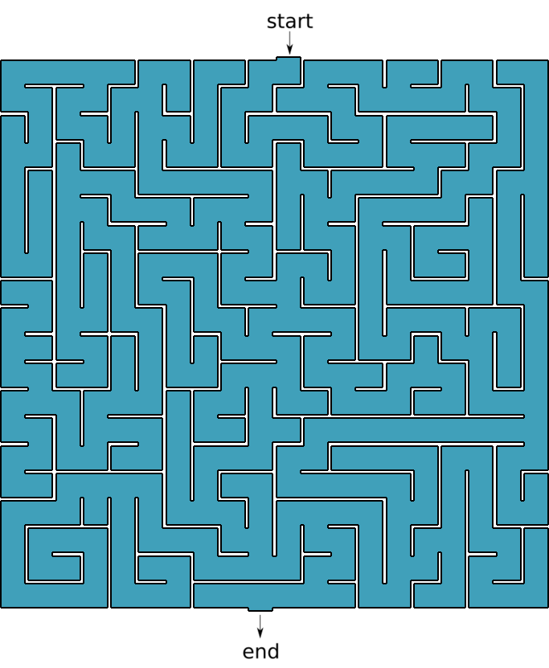{height=8cm}
:::
::: {.column width="50%"}

{width=48%}
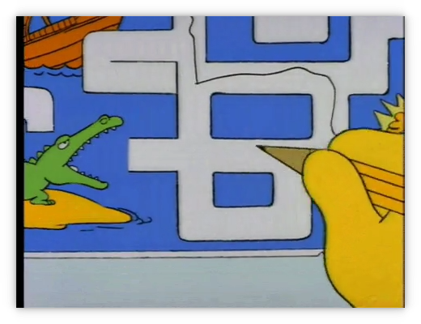{width=48%}


 1. Go to <http://www.mazegenerator.net/>
 2. Create a maze
 3. Download it in PNG
 4. Perform some conversions
     - PNG $\rightarrow$ PNM $\rightarrow$ SVG $\rightarrow$ DXF $\rightarrow$ GEO
 
    ```terminal
    $ wget http://www.mazegenerator.net/static/orthogonal_maze_with_20_by_20_cells.png
    $ convert orthogonal_maze_with_20_by_20_cells.png \ 
      -negate maze.png
    $ potrace maze.pnm --alphamax 0  --opttolerance 0 \ 
      -b svg -o maze.svg
    $ ./svg2dxf maze.svg maze.dxf
    $ ./dxf2geo maze.dxf 0.1
    ```
 
:::
::::::::::::::


## How to solve a maze without AI 2/3

:::::::::::::: {.columns}
::: {.column width="50%"}
 5. Open it with Gmsh 
 
    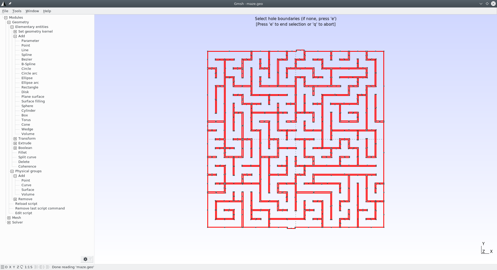\ 
 
    - Add a surface
    - Set physical curves for "start" and "end"
    
 6. Mesh it
 
    ```terminal
    gmsh -2 maze.geo
    ```
 
:::

::: {.column width="50%"}
\centering\includegraphics[height=8cm]{maze2.png}
:::
::::::::::::::


## How to solve a maze without AI 3/3


:::::::::::::: {.columns}
::: {.column width="50%"}
 7. Solve $\nabla^2 \phi = 0$ with BCs
    \vspace{-0.5cm}
    $$
    \begin{cases}
    \phi=0 & \text{at “start”} \\
    \phi=1 & \text{at “end”} \\
    \nabla \phi \cdot \hat{\vec{n}} = 0 & \text{everywhere else} \\
    \end{cases}
    $$

    \vspace{-0.5cm}
    
    ```{.feenox include="maze/maze.fee"}
    ```
   
    ```terminal
    $ feenox maze.fee
    $
    ```
 
    \ruleofpar{silence}
 
 8. Go to start and follow the gradient\ $\nabla \phi$!

:::

::: {.column width="50%"}
\only<1 | handout:0>{\centering\includegraphics[height=8cm]{maze2.png}}\only<2>{\centering\includegraphics[height=8cm]{maze3.png}}
:::
::::::::::::::

 

## The life of an influencer...

:::::::::::::: {.columns}
::: {.column width="50%"}

\centering {width=80%}

:::


::: {.column width="50%"}

<http://www.mazegenerator.net/Examples.aspx>

<!-- \centering {width=45%} -->

\centering {width=45%}
\centering 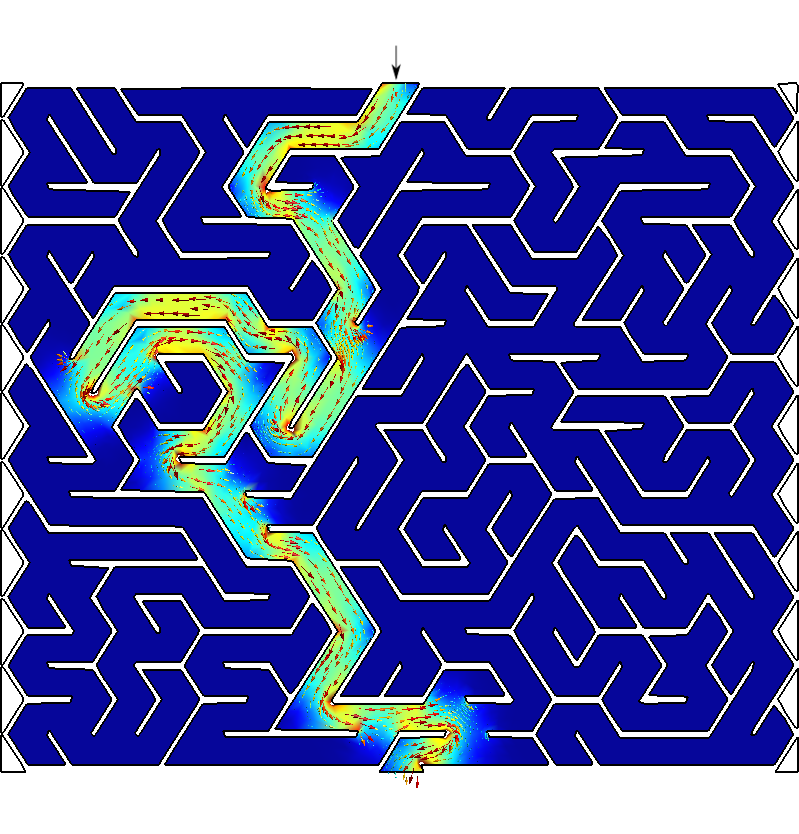{width=45%}

\centering 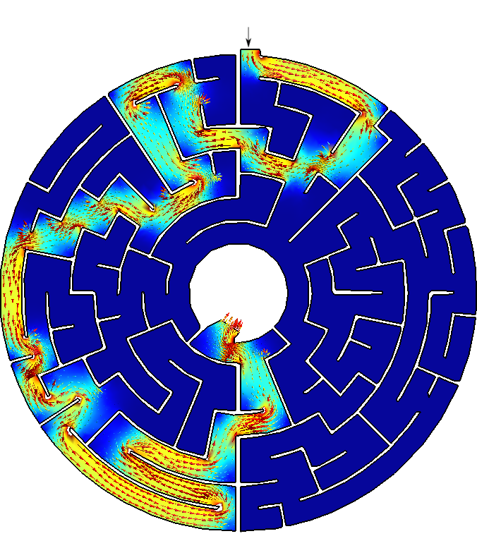{width=45%}
\centering {width=45%}
:::
::::::::::::::

## 

:::::::::::::: {.columns}
::: {.column width="50%"}

#### 2.1. Deployment

 * Automatically compile from source
    - Particular optimization flags
 * Availability of pre-compiled binaries
    - Common architectures and options
 * Both of them have to be available online

#### 2.2. Execution

 * Remote execution, either
    - By a direct user action
    - From a higher-level workflow
 * Outer loops have to be supported
    - scripted
    - parametric
    - optimization
 * Ways to read data from the outer loop
 * Ways to write scalar figures of merit
 
:::

. . .

::: {.column width="50%"}

### FeenoX {.example}

 * Compile optimized dependencies
   
   ```terminal
   $ cd $PETSC_DIR
   $ export PETSC_ARCH=linux-fast
   $ ./configure --with-debug=0 COPTFLAGS="-Ofast"
   $ make -j8
   ```
 
 * Configure FeenoX with particular flags
   
   ```terminal
   $ git clone https://github.com/seamplex/feenox
   $ cd feenox
   $ ./autogen.sh
   $ export PETSC_ARCH=linux-fast
   $ ./configure MPICH_CC=clang CFLAGS=-Ofast
   $ make -j8
   # make install
   ```
   
 * Or use pre-compiled binaries
 
   ```terminal
   wget http://gmsh.info/bin/Linux/gmsh-Linux64.tgz
   wget https://seamplex.com/feenox/dist/linux/feenox-linux-amd64.tar.gz
   ```
   
 * Everything is Docker-friendly

 * Execution examples follow $\rightarrow$


:::
::::::::::::::


## Direct execution: three ways of getting the first 20 Fibonacci numbers

:::::::::::::: {.columns}
::: {.column width="60%"}
```{.feenox include="math/fibo_formula.fee"}
```

. . .

```{.feenox include="math/fibo_vector.fee"}
```

. . .

```{.feenox include="math/fibo_iterative.fee"}
```
:::

. . .

::: {.column width="40%"}
```terminal
$ feenox fibo_formula.fee | tee one
1	1
2	1
3	2
4	3
5	5
6	8
7	13
8	21
9	34
10	55
11	89
12	144
13	233
14	377
15	610
16	987
17	1597
18	2584
19	4181
20	6765
$ feenox fibo_vector.fee > two
$ feenox fibo_iterative.fee > three
$ diff one two
$ diff two three
$
```
:::
::::::::::::::


## Parametric execution: shear locking in cantilevered beam

:::::::::::::: {.columns}
::: {.column width="60%"}

```{.bash include="cantilever/cantilever.sh"}
```

```{.feenox include="cantilever/cantilever.fee"}
```
\ruleofpar{generation}

:::

::: {.column width="40%"}

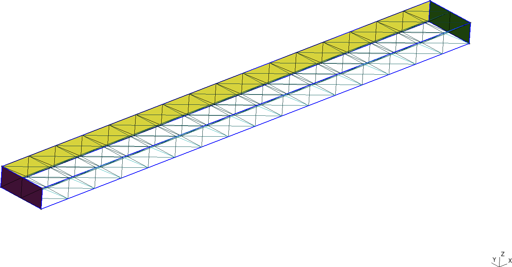


 * \ruleof{simplicity}
   - Only one material, no need to link volumes with materials
   ```feenox
   E = 2.1e11   # Young modulus in Pa
   ```
 

:::
::::::::::::::


## Parametric execution: shear locking in cantilevered beam


## Optimization loop: finding the right length of a tuning fork


:::::::::::::: {.columns}
::: {.column width="20%"}

\centering 

$\ell_1$ to have 440\ Hz?
:::

. . .

::: {.column width="40%"}

```python
import math
import gmsh
import subprocess  # to call FeenoX and read back

def create_mesh(r, w, l1, l2, n):
  gmsh.initialize()
  ...
  gmsh.finalize()
  return len(nodes)
  
def main():
  target = 440    # target frequency
  eps = 1e-2      # tolerance
  r = 4.2e-3      # geometric parameters
  w = 3e-3
  l1 = 30e-3
  l2 = 60e-3

  for n in range(1,7):   # mesh refinement level
    l1 = 60e-3              # restart l1 & error
    error = 60
    while abs(error) > eps:   # loop
      l1 = l1 - 1e-4*error
      # mesh with Gmsh Python API
      nodes = create_mesh(r, w, l1, l2, n)
      # call FeenoX and read scalar back
      # TODO: FeenoX Python API (like Gmsh)
      result = subprocess.run(['feenox', 'fork.fee'], stdout=subprocess.PIPE)
      freq = float(result.stdout.decode('utf-8'))
      error = target - freq
    
    print(nodes, l1, freq)
```
\ruleofpar{parsimony}

:::

::: {.column width="40%"}

```{.feenox include="fork/fork.fee"}
```
\ruleofpar{simplicity}

. . .

```terminal
$ python fork.py > fork.dat
$
``` 


:::
::::::::::::::

## 

:::::::::::::: {.columns}
::: {.column width="47.5%"}

#### 2.3. Efficiency

 * Similar to to other tools in terms of
    - CPU/GPU
    - RAM
    - Storage

#### 2.4. Scalability

 * Small problems to check correctness
 * Large problems in parallel
    - Reasonable weak & strong scalability
    
#### 2.5. Flexibility

 * Engineering problems with
    - Multiple materials
    - Space-dependent properties
    - Space & time-dependent BCs
 * Handle point-wise data
    - Properties
    - Time-dependent scalars
    
:::

. . .

::: {.column width="52.5%"}

### FeenoX {.example}

 * First make it work, then optimize
   - \ruleof{optimization}
 * Premature optimization is the root of all evil
   - Optimization: \todolater
   - Parallelization: \todolater
   - Comparison: \todolater
 * Linear solvers
   - Direct solver MUMPS
     - Robust but not scalable
   - GAMG-preconditioned KSP
     - Near-nullspace improves convergence
 * Non-linear & transient solvers
   - Scalable as PETSc
 * Written in ANSI C99 (no C++ nor Fortran)
    * Autotools & friends, POSIX
    * Tested with `gcc`, `clang` and `icc`
    * Rust & Go, can't tell (yet)
    * \ruleof{transparency}
 * Flexibility follows $\rightarrow$
::: 
::::::::::::::

## Flexibility I: one-dimensional thermal slab

:::::::::::::: {.columns}
::: {.column width="45%"}

Solve heat conduction on the slab $x \in [0:1]$ with boundary conditions

$$
\begin{cases}
T(0) = 0 & \text{(left)} \\
T(1) = 1 & \text{(right)} \\
\end{cases}
$$

\noindent and uniform conductivity. Compute $T\left(\frac{1}{2}\right)$.

. . . 

 * English self-evident ASCII input
   - Syntactic sugar
   - Simple problems, simple inputs
   - Robust (`heat` or `thermal`)

 * Mesh separated from problem
   - Git-friendly `.geo` & `.fee`
   
 * Output is 100% user-defined
   - No `PRINT` no output
   - \ruleof{silence}
  
 * There is no node at $x=1/2=0.5$!
   
:::

::: {.column width="55%"}

```{.c include="thermal-slabs/slab.geo"}
```
\ruleofpar{composition}

```{.feenox include="thermal-slabs/thermal-1d-dirichlet-uniform-k.fee"}
```
\ruleofpar{simplicity}

```terminal
$ gmsh -1 slab.geo
[...]
Info    : 4 nodes 5 elements
Info    : Writing 'slab.msh'...
[...]
$ feenox thermal-1d-dirichlet-uniform-k.fee 
0.5
$ 
```
\ruleofpar{economy}
:::

::::::::::::::

## Flexibility II: one-dimensional thermal slabs


:::::::::::::: {.columns}
::: {.column width="45%"}

```{.feenox include="thermal-slabs/thermal-1d-dirichlet.fee"}
```


```{.feenox include="thermal-slabs/uniform.fee"}
```

```{.feenox include="thermal-slabs/space.fee"}
```

```{.feenox include="thermal-slabs/temperature.fee"}
```

. . . 

 * Everything is an expression
 * Similar problems need similar inputs
 * \ruleof{least surprise}: $k(x)=1+x$
   
:::

::: {.column width="55%"}

```bash
for i in uniform space temperature; do
  feenox thermal-1d-dirichlet.fee ${i} > ${i}.dat
done
```

\centering {width=75%}

 * FeenoX can tell that $k(T)$ is non-linear
   - It switchs from [`KSP`](https://petsc.org/release/docs/manual/ksp/) to [`SNES`](https://petsc.org/release/docs/manual/snes/)

:::

::::::::::::::


## Flexibility III: two squares in thermal contact

:::::::::::::: {.columns}
::: {.column width="50%"}

\centering {width=65%}

```{.feenox include="two-squares/two-squares.fee"}
```
\ruleofpar{clarity}
:::

. . .

::: {.column width="50%"}


\centering {width=70%}

\centering {width=70%}
 
 * Volumes $\Leftrightarrow$ materials now needed
 * FeenoX detects the problem is non-linear
 * \todolater: roughish output
:::
::::::::::::::

## Flexibility IV: thermal transient with time-dependent BCs

:::::::::::::: {.columns}
::: {.column width="50%"}

\centering {width=75%}

:::

. . .

::: {.column width="50%"}

```{.feenox include="nafems-t3/nafems-t3.fee"}
```

```terminal
$ feenox nafems-t3.fee 
0.000   0.062   0.00    0.00
0.002   0.002   0.01    0.00
[...]
30.871  0.565   65.71   36.04
31.435  0.565   62.31   36.33
32.000  1.050   58.78   36.56
# result =      36.5636 ºC
$
```

:::
::::::::::::::

## Flexibility V: 3D thermal transient with $k(\vec{x})$


\centering 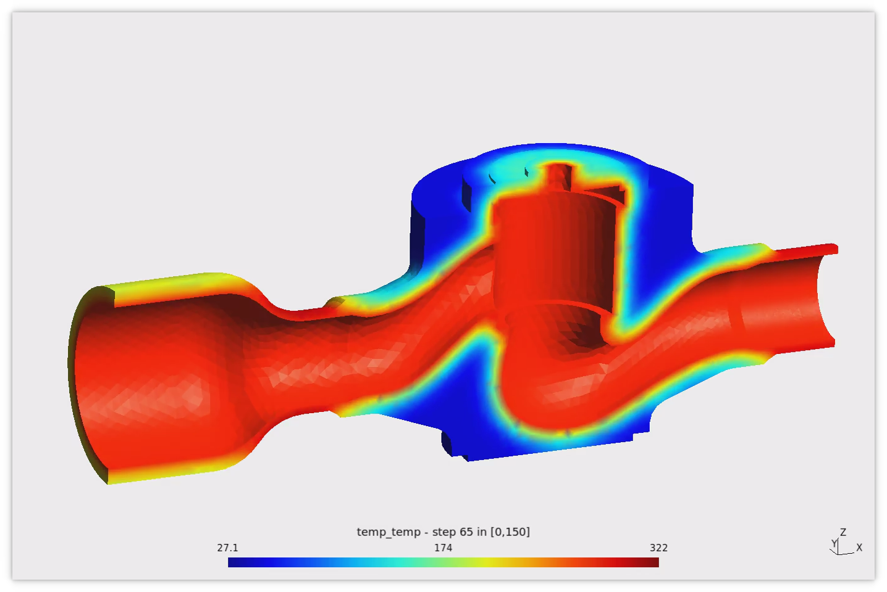{width=70%}

<https://www.seamplex.com/feenox/videos/temp-valve-smooth.mp4>


## Flexibility VI: point kinetics with point-wise reactivity

:::::::::::::: {.columns}
::: {.column width="45%"}

$$
\begin{cases}
\dot{\phi}(t) = \displaystyle \frac{\rho(t) - \Beta}{\Lambda} \cdot \phi(t) + \sum_{i=1}^{N} \lambda_i \cdot c_i \\
\dot{c}_i(t)  = \displaystyle \frac{\beta_i}{\Lambda} \cdot \phi(t) - \lambda_i \cdot c_i
\end{cases}
$$

\vspace{-0.5cm}

 $t$ [s] | $\rho(t)$ [pcm]
--------:|-----------:
 0       |  0
 5       |  0
 10      | 10
 30      | 10
 35      |  0
 100     |  0 

\vspace{-0.5cm}

\noindent for $0 < t < 100$ starting from steady-steate conditions at full power.
:::

. . .

::: {.column width="55%"}
```{.feenox include="kinetics/reactivity-from-table.fee"}
```

```terminal
$ feenox reactivity-from-table.fee > flux.dat
$
```

:::
::::::::::::::

## 

\centering 

## Flexibility VI: inverse kinetics

:::::::::::::: {.columns}
::: {.column width="50%"}
```{.feenox include="kinetics/inverse-integral.fee"}
```

. . . 

```{.feenox include="kinetics/inverse-dae.fee"}
```

:::


. . .

::: {.column width="50%"}

```terminal
$ feenox inverse-dae.fee flux.dat > inverse-dae.dat
$ feenox inverse-integral.fee flux.dat > inverse-integral.dat
```

\centering {width=80%}

\centering {width=80%}

:::
::::::::::::::


## 

:::::::::::::: {.columns}
::: {.column width="50%"}

#### 2.6. Extensibility

 * Possibility to add more features
   - More PDEs
   - New material models (i.e. stress-strain)
   - Other element types
 * Clear licensing scheme for extensions
 
#### 2.7. Interoperability

 * Ability to exchange data with other tools following this SRS
   - Pre and post processors
   - Optimization tools
   - Coupled multi-physics calculations
    
:::

. . .

::: {.column width="50%"}

### FeenoX {.example}

 * Think for the future! \ruleof{extensibility}
   - GPLv3**+**: the '+' is for the future
 * Nice-to-haves: \todolater
   - Lagrangian elements, DG, $h$-$p$ AMR, ...
 * Other problems & formulations: \todolater
   - Each PDE has an independent directory
   - "Virtual methods" as function pointers
   - Use Laplace as a template (elliptic)
 * Coupled calculations: \todolater
   - Wide experience from CNA2 (v2)
   - Plain (RAM-disk) files
   - Shared memory & semaphores
   - MPI
 * Interoperability
   - Gnuplot, matplotlib, etc.
   - Gmsh (+ Meshio), Paraview
   - CAEplex
   - PrePoMax, FreeCAD, ...: \todolater

  
:::
::::::::::::::


## Laplace equation with both Gmsh & Paraview as post-processors

:::::::::::::: {.columns}
::: {.column width="60%"}

Solve $\nabla^2 \phi = 0$ over $[-1:+1]\times[-1:+1]$ with

$$
\begin{cases}
\phi(x,y) = +y & \text{for $x=-1$ (left)} \\
\phi(x,y) = -y & \text{for $x=+1$ (right)} \\
\nabla \phi \cdot \hat{\vec{n}} = \sin\left(\frac{\pi}{2} x\right) & \text{for $y=-1$ (bottom)} \\
\nabla \phi \cdot \hat{\vec{n}} =0 & \text{for $y=+1$ (top)} \\
\end{cases}
$$

```{.feenox include="laplace/laplace-square.fee"}
```
\ruleofpar{diversity} 

:::

. . .

::: {.column width="40%"}

\centering \hspace{0.5cm}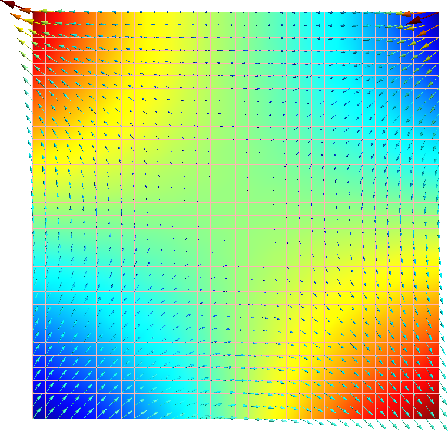{width=70%}\

\centering 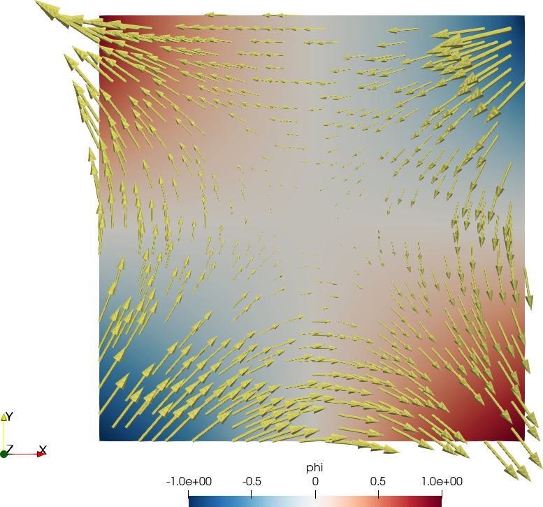{width=80%}\


:::
::::::::::::::


## 

:::::::::::::: {.columns}
::: {.column width="50%"}

### 3. Interfaces

 * Fully human-less execution
   - Input files (1 or more)
   - Output files (0 or more)
 * Ability to remotely report status
   - Progress
   - Errors
   
#### 3.1. Input

 * Problem fully defined in input files
   - Ad-hoc syntax
   - API for high-level languages
   - Other files (data, meshes, scripts)
 * Preferably ASCII (for DCVS)
   - Avoid mixing problem and mesh data
 * GUI not mandatory but possible
   - Ok to have basic usage through GUI
   - Advanced features through API

:::

. . .

::: {.column width="50%"}

### FeenoX {.example}

 * Already deployed industrial human-less production workflow (based on v2)
 * There are ASCII progress bars
   - Build matrix
   - Solve equations
   - Gradient recovery
 * Heartbeat: \todolater

\medskip 
 
 * English self-evident ASCII input
   - Syntactically-sugared
     - Nouns are definitions
     - Verbs are instructions
   - Simple problems, simple inputs
   - Similar problems, similar inputs
   - Everything is an expression!
   - \ruleof{least surprise}: $f(x)=\frac{1}{2} \cdot x^2$
     ```feenox
     f(x) = 1/2 * x^2  
     ```
   - Expansion of command line arguments
:::
::::::::::::::


## CAEplex progress status on the cloud

\centering {width=70%}

<https://www.seamplex.com/feenox/videos/caeplex-progress.mp4>

## NAFEMS LE10: English-like problem definition & user-defined output

:::::::::::::: {.columns}
::: {.column width="50%"}

\centering 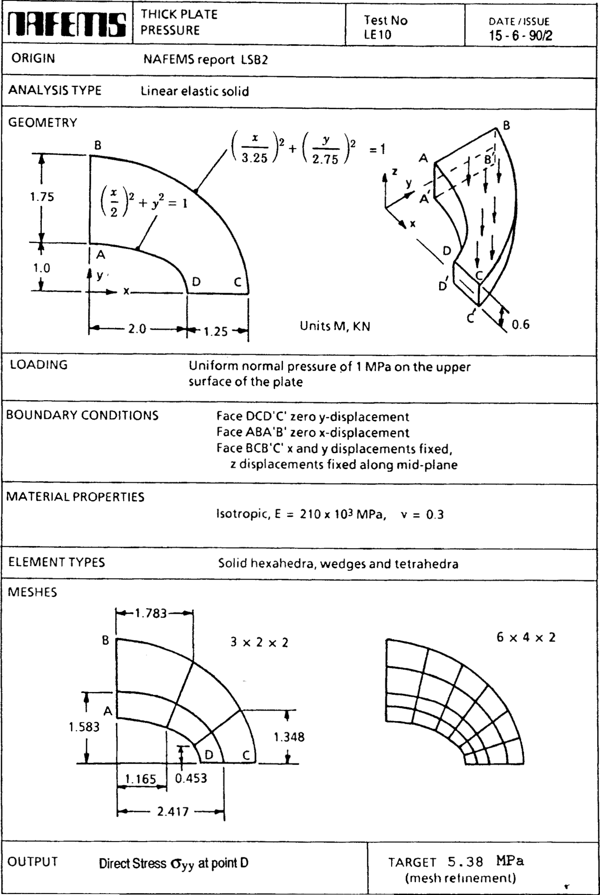{width=75%}

:::

. . .

::: {.column width="50%"}

```{.feenox include="nafems-le10/nafems-le10.fee"}
```
\ruleofpar{clarity}

```terminal
$ gmsh -3 nafems-le10.geo
[...]
Info    : Done meshing order 2 (Wall 0.433083s, CPU 0.414008s)
Info    : 205441 nodes 59892 elements
Info    : Writing 'nafems-le10.msh'...
$ feenox nafems-le10.fee 
sigma_y @ D =  -5.38361 MPa
$
```
\ruleofpar{economy}
:::
::::::::::::::


## NAFEMS LE11: everything is an expression (especially temperature)

:::::::::::::: {.columns}
::: {.column width="50%"}

\centering {width=75%}

:::

. . .

::: {.column width="50%"}

```{.feenox include="nafems-le11/nafems-le11.fee"}
```
\ruleofpar{least surprise}

```terminal
$ gmsh -3 -clscale 0.5 nafems-le11.geo
[...]
Info    : 8326 nodes 1849 elements
Info    : Writing 'nafems-le11.msh'...
$ feenox nafems-le11.fee 
sigma_z(A) =  -105.043 MPa
$
```

 * [3D distributions in VTK](https://www.seamplex.com/feenox/videos/nafems-le11.vtk)

:::
::::::::::::::


## 

:::::::::::::: {.columns}
::: {.column width="50%"}

 
#### 3.2. Output

 * Clean output expected
 * Do not clutter the output with
   - ASCII art
   - Notices
   - Explanations
   - Page separators
 * Output should interpreted by both
   - A human
   - A computer
 * Open standards and well-documented formats should be preferred
    
:::

. . .

::: {.column width="50%"}

### FeenoX {.example}

 * \ruleof{economy}: output is completely defined by the user
 * \ruleof{silence}: no `PRINT` no output
 * ASCII columns
   * `PRINT` & `PRINT_FUNCTION` 
   * Gnuplot & compatible
   * Markdown/LaTeX tables
 * Post-processing formats 
   * `.msh`
   * `.vtk`
   * `.vtu`: \todolater
   * `.hdf5`: \todolater
   * `.frd`: \todolater ?
 * Dumping of vectors & matrices
   * ASCII
   * PETSc binary
   * Octave (sparse)

 
:::
::::::::::::::


## 100% user-defined output: cycle loads

:::::::::::::: {.columns}
::: {.column width="50%"}

For the model below, draw the sequence of loading and unloading for different levels of strains.
All bars have the same geometry and elastic properties but different yield stresses.


```bash
for i in 1 2 3 4; do
  feenox 3bars.fee ${i}
  pyxplot 3bars.ppl
  mv 3bars-sigma-vs-eps.pdf 3bars-sigma-vs-eps-${i}.pdf 
done  
```

:::

::: {.column width="50%"}

```{.feenox include="3bars/3bars.fee"}
```

:::
::::::::::::::


## 100% user-defined output: cycle loads

:::::::::::::: {.columns}
::: {.column width="50%"}
\centering {width=80%}
:::

::: {.column width="50%"}
\centering {width=80%}
:::
::::::::::::::

:::::::::::::: {.columns}
::: {.column width="50%"}
\centering {width=80%}
:::

::: {.column width="50%"}
\centering {width=80%}
:::
::::::::::::::


## Markdown table: natural oscillation frequencies of a wire


:::::::::::::: {.columns}
::: {.column width="40%"}

Experimental Physics 101 (2004)

\centering {width=70%}
:::

::: {.column width="60%"}

```feenox
# compare the frequencies
PRINT "  \$n\$ |   FEM  | Euler | Relative difference [%]"
PRINT ":----:+:------:+:-----:+:-----------------------:"
PRINT_VECTOR i         f(2*i-1) f_euler   100*(f_euler(i)-f(2*i-1))/f_euler(i)
PRINT
PRINT ": $2 wire over $1 mesh, frequencies in Hz"
```

```terminal
$ feenox wire.fee copper hex > copper-hex.md
$
```

  $n$ |   FEM  | Euler | Relative difference [%]
:----:+:------:+:-----:+:-----------------------:
1     | 45.8374|45.8448|0.0161707
2     | 287.126|287.302|0.0611787
3     | 803.369|804.454|0.134888
4     | 1572.59|1576.41|0.242324
5     | 2595.99|2605.92|0.381107

: copper wire over hex mesh, frequencies in Hz

:::
::::::::::::::


## Professional tables: environmentally-assisted fatigue

:::::::::::::: {.columns}
::: {.column width="55%"}

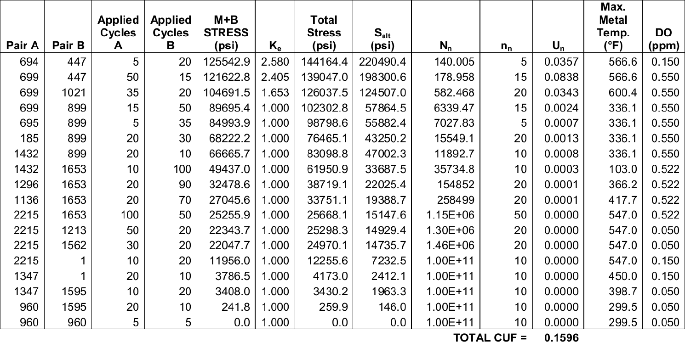


:::

::: {.column width="45%"}

\vspace{1cm}

 * Computation of NUREG-EPRI sample problem for Environmentally-assisted fatigue in NPP piping

\bigskip 
 
 * Top is a table from a publication by a multi-billion dollar agency
 * Bottom is a PDF from FeenoX output piped through
   - AWK
   - \LaTeX

:::
::::::::::::::

## Data for videos I: four double pendulums (v2)

\centering 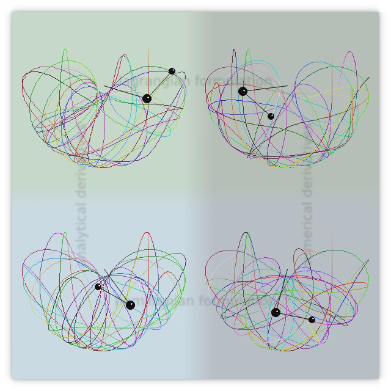{width=50%}

<https://www.seamplex.com/feenox/videos/pendulums.webm>


## Data for videos II: boiling channel with sinusoidal power profile (v2)

\centering {width=65%}

<https://www.seamplex.com/feenox/videos/sine.webm>

## Data for videos III: modal analysis for seismic analysis of piping (v2)

\centering 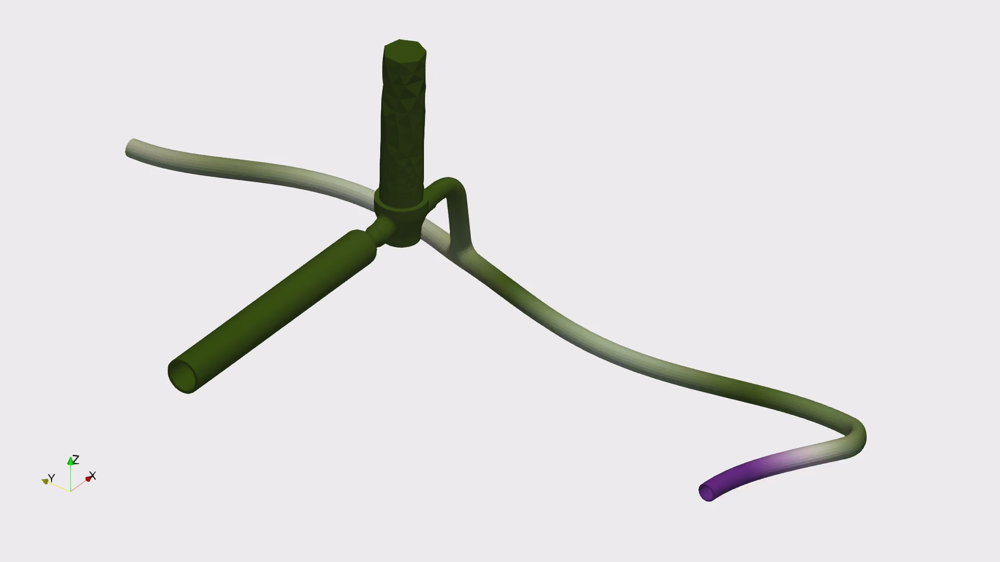{width=75%}

<https://www.seamplex.com/feenox/videos/mode5.mp4>
<https://www.seamplex.com/feenox/videos/mode6.mp4>
<https://www.seamplex.com/feenox/videos/mode7.mp4>

## Complex figures: 2D IAEA PWR Benchmark (v2)

:::::::::::::: {.columns}
::: {.column width="50%"}
\centering 
:::

::: {.column width="50%"}
\centering 
:::
::::::::::::::

## Complex figures: 2D IAEA PWR Benchmark (v2)

:::::::::::::: {.columns}
::: {.column width="50%"}
\centering 
:::

::: {.column width="50%"}
\centering 
:::
::::::::::::::


## Core-level neutronics over unstructured grids: the $S_2$ Stanford Bunny (v2)

:::::::::::::: {.columns}
::: {.column width="50%"}

\centering 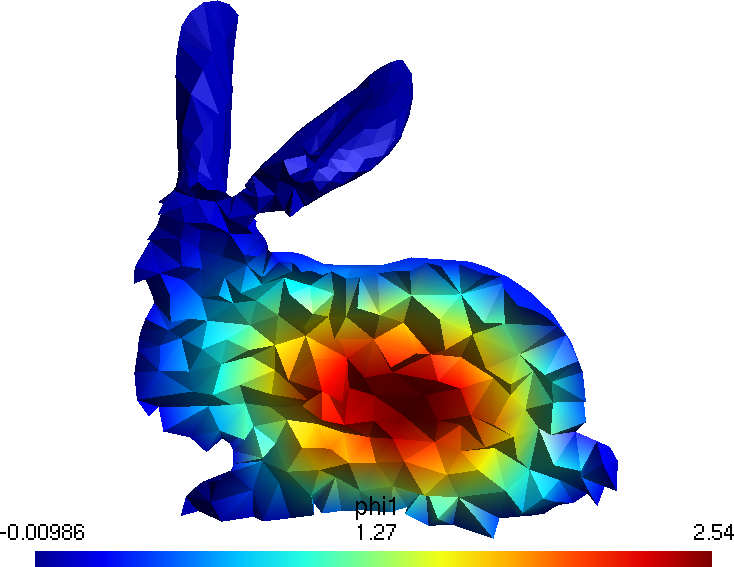{height=4cm}

:::
::: {.column width="50%"}

\vspace{1cm}

 * One-group neutron transport
 * The Stanford Bunny as the geometry
 * $S_2$ method in 3D (8 angular directions)
 * Finite elements for spatial discretization
 
:::
::::::::::::::


:::::::::::::: {.columns}
::: {.column width="25%"}
\centering 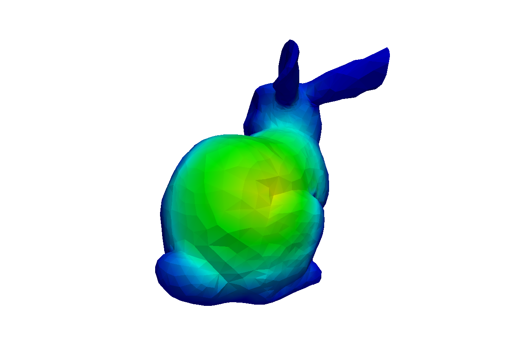{height=2cm}
:::
::: {.column width="25%"}
\centering {height=2cm}
:::
::: {.column width="25%"}
\centering 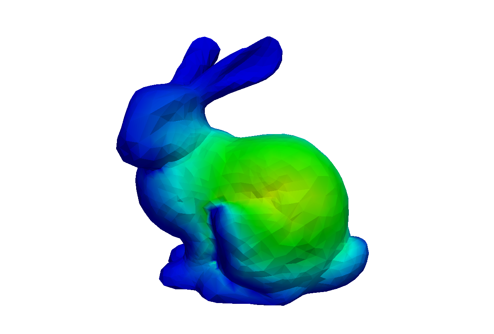{height=2cm}
:::
::: {.column width="25%"}
\centering 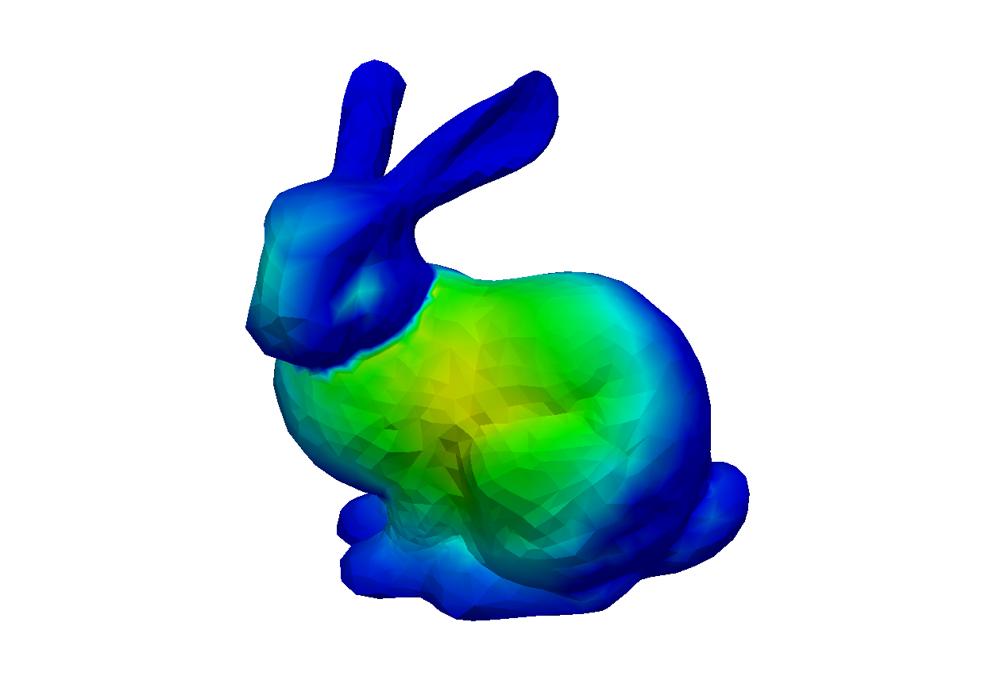{height=2cm}
:::
::::::::::::::
:::::::::::::: {.columns}
::: {.column width="25%"}
\centering {height=2cm}
:::
::: {.column width="25%"}
\centering {height=2cm}
:::
::: {.column width="25%"}
\centering {height=2cm}
:::
::: {.column width="25%"}
\centering {height=2cm}
:::
::::::::::::::


## 

:::::::::::::: {.columns}
::: {.column width="50%"}

### 4. Quality Assurance
 
 * Generic good software QA practices
   - Distributed version control system
   - Automated testing suites
   - User-reported bug tracking support
   - Signed releases
   - etc.

#### 4.1. Reproducibility and traceability

 * Both the source and the documentation should be tracked with a DVCS
 * Repository should be accessible online
   - Might need credentials even for RO
 * Version reporting 
   - Executables must allow `--version` 
   - Libraries must provide an API call
 * The files needed to solve a problem should be simple & traceable by a DVCS

:::

. . .

::: {.column width="50%"}

### FeenoX {.example}

 * Hosted on Github (`git`)
   - Previously on Bitbucket (`hg`)
   - Previously on Launchpad (`bzr`)
   - Previously on-premise (`svn`) 
 * <https://github.com/seamplex/feenox>
 * <https://seamplex.com/feenox>
 * Mailing list (Google group)
 * Build a community! \todolater
   - Code of conduct
   
```terminal
$ feenox
FeenoX v0.1.12-gb9a534f-dirty 
a free no-fee no-X uniX-like finite-element(ish) computational engineering tool

usage: feenox [options] inputfile [replacement arguments]
[...]
$
```

 * `-v`/`--version`: copyright notice
 * `-V`/`--versions`: linked libraries

 * \ruleof{generation}: inputs from M4 

:::
::::::::::::::


## 

:::::::::::::: {.columns}
::: {.column width="50%"}
 
#### 4.2. Automated testing

 * A mean to test the code is mandatory
 * After each change
   - Check for regressions
   - Problems with already-computed solutions
   - Different from verification
 * The compiler should not issue warnings
 * Dynamic memory allocation checks are recommended
 * Good practices are suggested
   - Unit testing
   - Continuous integration
   - Test coverage analysis

#### 4.3. Bug reporting and tracking

 * Users should be able to report bugs
   - A task should be created for each report
   - Address and document
:::

. . .

::: {.column width="50%"}

### FeenoX {.example}

 * Standard test suite

   ```terminal
   $ make check
   Making check in src
   [...]
   PASS: tests/trig.sh
   PASS: tests/vector.sh
   =============================================
   Testsuite summary for feenox v0.1.12-gb9a534f
   =============================================
   # TOTAL: 26
   # PASS:  25
   # SKIP:  0
   # XFAIL: 1
   # FAIL:  0
   # XPASS: 0
   # ERROR: 0
   =============================================
   $
   ```


 * Periodic `valgrind` runs
 * Integration tests: \todolater
 * CI & test coverage: \todolater
 
\medskip

 * Github issue tracker
 * Branching & merging procedures: \todolater


:::
::::::::::::::


## 

:::::::::::::: {.columns}
::: {.column width="50%"}
 

   
#### 4.4 Verification

 * Code must be always verified
 * Check it solves **right the equations**
   - MES (mandatory)
   - MMS (recommended)
 * One test case has to be added to the automated testing
 * Third-party verification should be allowed
 * Per-problem documentation


 
#### 4.5. Validation

 * Code should be validated as required 
 * Check it solves **the right equations**
   - Against experiments
   - Against other codes
 * Third-party validation should be allowed
 * Per-application/industry documentation
   - Procedures following standards
   
:::

. . .

::: {.column width="50%"}

### FeenoX {.example}

 * There is a V&V report for the industrial human-less workflow project
   - Medical devices
   - Based on ASME V&V 40

 * There is a lot to do!
 
 * MES
   - Set of well-known benchmarks
   - NAFEMS, IAEA, etc.
   
 * MMS
   - Everything is an expression
   - Parametric runs
   - `MESH_INTEGRATE` allows to compute $L_2$ norms directly in the `.fee`

\bigskip
   
 * TL;DR: \todolater
   
:::
::::::::::::::


## Experimental Validation

\centering {width=65%}

<https://fusor.net/board/viewtopic.php?f=13&t=14087> $\leftarrow$ because it is FOSS!


## 

:::::::::::::: {.columns}
::: {.column width="50%"}

 
#### 4.6. Documentation

 * Documentation should be complete
   - User manual
     - Tutorial
     - Reference
   - Developer guide 
 * Quick reference cards, video tutorials, etc. not mandatory but recommended
 * Non-trivial mathematics and methods
   - Explained
   - Documented
 * Should be available as hard copies and mobile-friendly online
 * Clear licensing scheme for the documentation
   - People extending the functionality ought to be able to document their work
 
:::
::: {.column width="50%"}

### FeenoX {.example}

 * FeenoX is not compact!
   - Even I have to check the reference
 * Commented sources: \todonow
   - Keywords
   - Functions
   - Functionals
   - Variables
   - Material properties
   - Boundary conditions
   - Solutions
 * Shape functions: \todonow
 * Gradient recovery: \todonow
 * Mathematical models: \todonow
 
\medskip
 
 * Code is GPLv3+
 * Documentation is GFDLv1.3+

:::
::::::::::::::


## Conclusions---FeenoX...

 * closes a 15-year loop (2006--2021) with a third-system effect
 * is to FEA what Markdown is to documentation
 * is (so far) the only tool that fulfills 100% a fictitious SRS:
   - Free and open source (GPLv3+)
   - No recompilation needed
   - Cloud and web friendly
   - Human-less workflow
 * follows the \unix philosophy: "do one thing well"
 * is already usable (and used!)
   - FeenoX v1.0 coincident with the PhD (\todonow)
     - Laplace, heat, elasticity, modal, neutron transport & diffusion
     - Every current feature is there because there was at least one need from an actual project
   - Future versions online (\todolater)
     - Electromagnetism? CFD? Schrödinger's equation?
     - Python & Julia API
     - Coupled & multiphysics computations
     - Free and open-source online community


