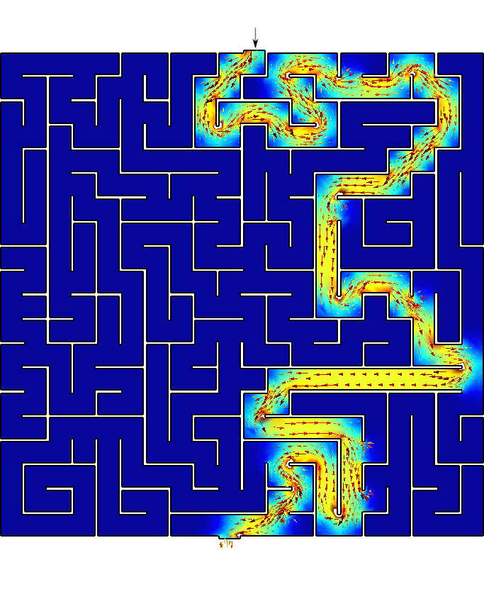

---
title: A free and open source computational tool to solve differential equations in the cloud
author: Jeremy Theler
email: jeremy@seamplex.com
aspectratio: 169
lang: en-US
theme: default
innertheme: rectangles
fonttheme: professionalfonts
outertheme: number
colorlinks: true
sansfont: Carlito
monofont: DejaVuSansMono
header-includes: \include{syntax.tex}\newsavebox{\mybox}
handout: false
...

## Background 1/2


 * 2007 Fuzzy logic & chaotic natural convection loops @ IB
 * 2008 Instabilities in the coupled neutronic-thermal-hydraulic problem @ IB
 * 2008 TECNA---CNA2
 * 2009 First attempt at PhD---v1
 * 2010 Paper on stability of point kinetics @ Nuc. Eng. & Design
 * 2010 First presentation of milonga at AATN
 * 2011 First ME with milonga (mrivero) @ UBA
 * 2011 IMEF $\rightarrow$ milonga with FEM @ UBA 
 * 2012 Paper generalized boiling channel @ ENIEF
 * 2013 Monograph milonga FEM vs. FVM @ UBA
 * 2013 Paper unstructured grids for neutron diffusion

 
## Background 2/2

 * 2013 Doppler measurement @ CNA1---v2
 * 2014 Design basis @ ENIEF
 * 2014 Doppler measurement @ CNA2
 * 2015 Workshop milonga @ CAC
 * 2016 First PhD with milonga (vitor) @ Belo Horizonte
 * 2017 Fatigue for LTE @ CNE
 * 2018 Opportunity @ KAIST---second attempt at PhD
 * 2020 Remote courses---third attempt at PhD
 * 2021 FeenoX (v3)
 * 2021 Simulation courses @ UNICEN


 

## How do we write papers/reports/documents?

\newcommand{\good}{\textcolor{OliveGreen}{$\checkmark$}}
\newcommand{\bad}{\textcolor{red}{$\times$}}
\newcommand{\neutral}{\textcolor{DarkBlue}{$\sim$}}

   
:::::::::::::: {.columns}
::: {.column width="25%"}
\centering \onslide<1->{\includegraphics[height=2cm]{word}}
:::

::: {.column width="25%"}
\centering \onslide<3->{\includegraphics[height=2cm]{google_docs}}
:::

::: {.column width="25%"}
\centering \onslide<4->{\includegraphics[height=2cm]{markdown}}
:::

::: {.column width="25%"}
\centering \onslide<2->{\includegraphics[height=2cm]{tex}}
:::
::::::::::::::

\rowcolors{1}{black!10}{black!0}

 Feature                | \onslide<1->{Word}     |   \onslide<3->{Docs}     |  \onslide<4->{Markdown}    |  \onslide<2->{\TeX}
:-----------------------|:----------------------:|:------------------------:|:--------------------------:|:------------------------:
 Aesthetics             | \onslide<1->{\bad}     |   \onslide<3->{\bad}     |  \onslide<4->{\good}       |  \onslide<2->{\good}
 Convertibility         | \onslide<1->{\neutral} |   \onslide<3->{\neutral} |  \onslide<4->{\good}       |  \onslide<2->{\neutral}
 Traceability           | \onslide<1->{\bad}     |   \onslide<3->{\neutral} |  \onslide<4->{\good}       |  \onslide<2->{\good}
 Mobile-friendly        | \onslide<1->{\bad}     |   \onslide<3->{\good}    |  \onslide<4->{\good}       |  \onslide<2->{\bad}
 Collaborative          | \onslide<1->{\bad}     |   \onslide<3->{\good}    |  \onslide<4->{\good}       |  \onslide<2->{\neutral}
 Licensing/openness     | \onslide<1->{\bad}     |   \onslide<3->{\bad}     |  \onslide<4->{\good}       |  \onslide<2->{\good}
 Non-nerd friendly      | \onslide<1->{\good}    |   \onslide<3->{\good}    |  \onslide<4->{\neutral}    |  \onslide<2->{\bad}

 
 
 
## How do we do scientific/engineering computations?

:::::::::::::: {.columns}
::: {.column width="25%"}
\centering \onslide<1->{\includegraphics[height=2cm]{prepomax}}
:::

::: {.column width="25%"}
\centering \onslide<3->{\includegraphics[height=2cm]{caeplex}}
:::

::: {.column width="25%"}
\centering \onslide<4->{\includegraphics[height=2cm]{feenox-logo}}
:::

::: {.column width="25%"}
\centering \onslide<2->{\includegraphics[height=2cm]{libraries}}
:::
::::::::::::::

\rowcolors{1}{black!10}{black!0}

 Feature                | \onslide<1->{Desktop GUIs}         |   \onslide<3->{Web frontends} |  \onslide<4->{FeenoX}      |  \onslide<2->{Libraries}
:-----------------------|:----------------------------------:|:-----------------------------:|:--------------------------:|:-----------------------------:
 Flexibility            | \onslide<1->{\neutral}             |   \onslide<3->{\bad}          |  \onslide<4->{\good}       |  \onslide<2->{\good}
 Scalability            | \onslide<1->{\bad}                 |   \onslide<3->{\neutral}      |  \onslide<4->{\good}       |  \onslide<2->{\good}
 Traceability           | \onslide<1->{\bad}                 |   \onslide<3->{\neutral}      |  \onslide<4->{\good}       |  \onslide<2->{\good}
 Cloud-friendly         | \onslide<1->{\bad}                 |   \onslide<3->{\good}         |  \onslide<4->{\good}       |  \onslide<2->{\good}
 Collaborative          | \onslide<1->{\bad}                 |   \onslide<3->{\good}         |  \onslide<4->{\neutral}    |  \onslide<2->{\bad}
 Licensing/openness     | \onslide<1->{\good/\neutral/\bad}  |   \onslide<3->{\bad}          |  \onslide<4->{\good$^*$}   |  \onslide<2->{\good}
 Non-nerd friendly      | \onslide<1->{\good}                |   \onslide<3->{\good}         |  \onslide<4->{\neutral}    |  \onslide<2->{\bad}
 
\onslide<4->{\centering $^*$ FeenoX is GPLv3+, i.e. “libre" or free as in “free speech”}


## Software Requirement Specifications

A fictitious & imaginary Request for Quotation for a computational tool:

:::::::::::::: {.columns}
::: {.column width="35%"}

 1. Introduction
    * 1.1. Objective
    * 1.2. Scope
 2. Architecture
    * 2.1. Deployment
    * 2.2. Execution
    * 2.3. Efficiency
    * 2.4. Scalability
    * 2.5. Flexibility
    * 2.6. Extensibility
    * 2.7. Interoperability
:::

::: {.column width="50%"}

 3. Interfaces
    * 3.1. Problem input
    * 3.2. Results output
 4. Quality assurance
    * 4.1. Reproducibility and traceability 
    * 4.2. Automated testing
    * 4.3. Bug reporting and tracking
    * 4.4. Verification
    * 4.5. Validation
    * 4.6. Documentation
:::
::::::::::::::


### FeenoX Software Design Specifications {.example}

 * A fictitious & imaginary tender applying to the SRS addressing each section.


## 

:::::::::::::: {.columns}
:::::: {.column width="50%"}

### 1. Introduction

 * Application to industrial problems
   - Open source (to allow third-party V&V)
 * First basic version should some problems
 * It should be extensible to other formulations 
   - Free (as in freedom to hire somebody to extend it)

#### 1.1. Objective

 * Solve DAEs and/or PDEs
    - Heat conduction
    - Elasticity
    - Electromagnetism
    - Fluid mechanics
    - ...
 * State-of-the-art cloud friendly

::::::

. . .

:::::: {.column width="50%"}

### FeenoX {.example}
 * Free as “software libre”
    * GPLv3+
    * Only FOSS dependencies
    * Main target is `linux-x86_64`
    * Development environment is Debian
\medskip

 * Initial version supports (v1 & v2)
   * Dynamical systems (DAE)
   * Laplace/Poisson/Helmholtz (FEM)
   * Heat (FEM)
   * Elasticity (FEM)
   * Modal (FEM)
   * Neutron transport and diffusion (FEM/FVM)
 * Templates for more formulations
   * Electromagnetism
   * Chemical diffusion/reaction
   * Fluid mechanics?

::::::
::::::::::::::


## 

:::::::::::::: {.columns}
:::::: {.column width="50%"}

#### 1.2. Scope

 * The problem should be defined progamatically
   - One or more input files (JSON, YAML, ad-hoc format), and/or
   - An API for high-level language (Python, Julia, etc.)
 * There is no need to _include_ a GUI
   - The tool should _allow_ a GUI to be used
     - Desktop
     - Web
     - Mobile
 * The mesh can be an input
   - As long as its creation meets the SRS
 * Include documentation about how a...
   - Pre-processor should create inputs
   - Post-processor should read outputs
   
::::::

. . .

:::::: {.column width="50%"}

### FeenoX {.example}

 * No GUI, console binary executable
 * "Transfer-function"-like between I/O
     * No need to recompile the binary
     
       {width=90%}\ 
   
 * English-like syntactic-sugared input files
    - nouns are definitions
    - verbs are instructions
 * Python & Julia API: TODO
   - But already taken into account in the design & implementation
 * Separate mesher
   - [Gmsh](http://gmsh.info/) (GPLv2, meets SRS)
   - Anything that writes `.msh`
 * Possibility to use GUI
   - CAEplex <https://www.caeplex.com>

::::::
::::::::::::::
 


## Lorenz’ system

:::::::::::::: {.columns}
::: {.column width="45%"}

Solve
$$
\begin{cases}
\dot{x} &= \sigma \cdot (y - x) \\
\dot{y} &= x \cdot (r - z) - y \\
\dot{z} &= x \cdot y - b \cdot z
\end{cases}
$$

\noindent for $0 < t < 40$ with initial conditions

$$
\begin{cases}
x(0) &= -11\\
y(0) &= -16\\
z(0) &= 22.5\\
\end{cases}
$$

\noindent and $\sigma=10$, $r=28$ and $b=8/3$.
:::

::: {.column width="55%"}
```{.feenox include="lorenz/lorenz.fee"}
```

```terminal
$ feenox lorenz.fee
0.000000e+00    -1.100000e+01   -1.600000e+01   2.250000e+01
2.384186e-07    -1.100001e+01   -1.600001e+01   2.250003e+01
4.768372e-07    -1.100002e+01   -1.600002e+01   2.250006e+01
[...]
3.997567e+01    4.442995e+00    3.764391e+00    2.347301e+01
3.998290e+01    4.399950e+00    3.886609e+00    2.314602e+01
3.999012e+01    4.368713e+00    4.016860e+00    2.282821e+01
$
```


:::
::::::::::::::

## 

\centering 

 
 

## 

:::::::::::::: {.columns}
::: {.column width="50%"}

### 2. Architecture

\newcommand{\ruleof}[1]{{\textcolor{cyan}{Rule of {#1}}}}
\newcommand{\ruleofpar}[1]{\vspace{-0.25cm}\hfill{\footnotesize\textcolor{cyan}{(Rule of {#1})}}}

 * Should run on mainstream cloud servers
   - GNU/Linux
   - Multi-core Intel-compatible CPUs
   - Several levels of memory cache
   - A few Gb of RAM
   - Several Gb of SSD
   - Either
     - Bare metal
     - Virtualized
     - Containerized
 * Standard compilers, libraries and dependencies
   - Available in common GNU/Linux repositories
   - Preferable 100% open source
   - Adhere to well-established standards

:::

. . .

::: {.column width="50%"}

### FeenoX {.example}

 * Third attempt (after v1 & v2)
 * UNIX philosophy: "do one thing well"
   - \ruleof{separation}: no GUI
   - \ruleof{composition}: Gnuplot, Gmsh, ...
   - ...
 * Third-party math libraries
   - GNU GSL, PETSc, SLEPc, SUNDIALS
 * Dependencies available in APT
 
    ```terminal
    apt-get install git gcc make automake autoconf
    apt-get install libgsl-dev
    apt-get install lib-sundials-dev petsc-dev slepc-dev
    ```

 * Sources on Github
 
    ```terminal
    git clone https://github.com/seamplex/feenox
    ```
    
    
 * Autotools & friends for compilation
 
    ```terminal
    ./autogen.sh && ./configure && make
    ```

:::
::::::::::::::

 
## 

:::::::::::::: {.columns}
::: {.column width="50%"}

### 2. Architecture

 * Small coarse problems should be run in single hosts to check inputs
    - Local desktop/laptops (not needed but suggested)
    - Windows and MacOS  (not needed but suggested)
    - Small cloud instances
 * Large actual problems should be split in several hosts
    - HPC clusters
    - Scalable cloud instances
 * Mobile devices (not needed but suggested)
    - As control/monitoring devices
:::

::: {.column width="50%"}

### FeenoX {.example}

 * Tested in
   - Raspberry Pi
   - Laptop (GNU/Linux & Windows 10)
   - Macbook
   - Desktop PC
   - Bare-metal servers
   - AWS/DigitalOcean/Contabo

 * Parallelization: TO-DO
   - Gmsh partitioning with METIS
   - PETSc/SLEPc with MPI

 * Mobile: TO-DO
:::
::::::::::::::


## How to solve a maze without AI 1/3

\renewcommand{\vec}{\mathbf}

:::::::::::::: {.columns}
::: {.column width="50%"}
\centering {height=8cm}
:::
::: {.column width="50%"}

{width=48%}
{width=48%}


 1. Go to <http://www.mazegenerator.net/>
 2. Create a maze
 3. Download it in PNG
 4. Perform some conversions
     - PNG $\rightarrow$ PNM $\rightarrow$ SVG $\rightarrow$ DXF $\rightarrow$ GEO
 
    ```terminal
    $ wget http://www.mazegenerator.net/static/orthogonal_maze_with_20_by_20_cells.png
    $ convert orthogonal_maze_with_20_by_20_cells.png \ 
      -negate maze.png
    $ potrace maze.pnm --alphamax 0  --opttolerance 0 \ 
      -b svg -o maze.svg
    $ ./svg2dxf maze.svg maze.dxf
    $ ./dxf2geo maze.dxf 0.1
    ```
 
:::
::::::::::::::


## How to solve a maze without AI 2/3

:::::::::::::: {.columns}
::: {.column width="50%"}
 5. Open it with Gmsh 
 
    \ 
 
    - Add a surface
    - Set physical curves for "start" and "end"
    
 6. Mesh it
 
    ```terminal
    gmsh -2 maze.geo
    ```
 
:::

::: {.column width="50%"}
\centering {height=8cm}\ 
:::
::::::::::::::


## How to solve a maze without AI 3/3


:::::::::::::: {.columns}
::: {.column width="50%"}
 7. Solve $\nabla^2 \phi = 0$ with BCs
    - $\phi=0$ at "start",
    - $\phi=1$ at "end",
    - $\nabla \phi \cdot \hat{\vec{n}} = 0$ everywhere else
 
   ```{.feenox include="maze/maze.fee"}
   ```
   
   ```terminal
   $ feenox maze.fee
   $
   ```
 
   \ruleofpar{silence}
 
 8. Go to start and follow the gradient $\nabla \phi$!

:::

. . .

::: {.column width="50%"}
\centering {height=8cm}\ 
:::
::::::::::::::

 

## The life on an influencer...

\centering 


## 

:::::::::::::: {.columns}
::: {.column width="50%"}

#### 2.1. Deployment

 * Automatically compile from source
    - Particular optimization flags
 * Availability of pre-compiled binaries
    - Common architectures and options
 * Both of them have to be available online

#### 2.2. Execution

 * Remote execution, either
    - By a direct user action
    - From a higher-level workflow
 * Outer loops have to be supported
    - scripted
    - parametric
    - optimization
 * Ways to read data from the outer loop
 * Ways to write scalar figures of merit
 
:::

::: {.column width="50%"}

### FeenoX {.example}

 * Compile optimized dependencies
   
   ```terminal
   $ cd $PETSC_DIR
   $ export PETSC_ARCH=linux-fast
   $ ./configure --with-debug=0 COPTFLAGS="-Ofast"
   $ make -j8
   ```
 
 * Configure FeenoX with particular flags
   
   ```terminal
   $ git clone https://github.com/seamplex/feenox
   $ cd feenox
   $ ./autogen.sh
   $ export PETSC_ARCH=linux-fast
   $ ./configure MPICH_CC=clang CFLAGS=-Ofast
   ```
   
 * Or use pre-compiled binaries
 
   ```terminal
   wget http://gmsh.info/bin/Linux/gmsh-Linux64.tgz
   wget https://seamplex.com/feenox/dist/linux/feenox-linux-amd64.tar.gz
   ```
   
 * Everything is Docker-friendly

 * Execution examples follow $\rightarrow$


:::
::::::::::::::


## Direct execution: three ways of getting the first 25 Fibonacci numbers

:::::::::::::: {.columns}
::: {.column width="60%"}
```{.feenox include="math/fibo_formula.fee"}
```

```{.feenox include="math/fibo_vector.fee"}
```

```{.feenox include="math/fibo_iterative.fee"}
```
:::

::: {.column width="40%"}
```terminal
$ feenox fibo_formula.fee | tee one
1	1
2	1
3	2
4	3
5	5
6	8
7	13
8	21
9	34
10	55
11	89
12	144
13	233
14	377
15	610
16	987
17	1597
18	2584
19	4181
20	6765
$ feenox fibo_vector.fee > two
$ feenox fibo_iterative.fee > three
$ diff one two
$ diff two three
$
```
:::
::::::::::::::


## Parametric execution: shear locking in cantilevered beam

:::::::::::::: {.columns}
::: {.column width="60%"}

```{.bash include="cantilever/cantilever.sh"}
```

```{.feenox include="cantilever/cantilever.fee"}
```
:::

::: {.column width="40%"}


:::
::::::::::::::


## Parametric execution: shear locking in cantilevered beam


## Optimization loop: finding the length of a tuning fork

Python with Gmsh API

single scalar back 


## 

:::::::::::::: {.columns}
::: {.column width="47.5%"}

#### 2.3. Efficiency

 * Similar to to other tools in terms of
    - CPU/GPU
    - RAM
    - storage

#### 2.4. Scalability

 * Small problems to check correctness
 * Large problems in parallel
    - Reasonable weak & strong scalability
    
#### 2.5. Flexibility

 * Engineering problems with
    - Multiple materials
    - Space-dependent properties
    - Space & time-dependent BCs
 * Handle point-wise data
    - Properties
    - Time-dependent scalars
    
:::

::: {.column width="52.5%"}

### FeenoX {.example}

 * First make it work, then optimize
 * Premature optimization is the root of all evil
   - Optimization: TO-DO
   - Parallelization: TO-DO
   - Comparison: TO-DO
 * Linear solvers
   - Direct solver MUMPS
     - Robust but not scalable
   - GAMG-preconditioned KSP
     - Near-nullspace improves convergence
 * Non-linear & transient solvers
   - Scalable as PETSc
 * Written in ANSI C99 (no C++ nor Fortran)
    * Autotools & friends
    * Tested with `gcc`, `clang` and `icc`
    * Rust & Go, can't tell (yet)
 * Flexibility follows $\rightarrow$
    * Based on the CNA2 experience!
::: 
::::::::::::::

## Flexibility I: one-dimensional thermal slabs

## Flexibility II: two squares in thermal contact

## Flexibility III: time-dependent BCs

## Flexibility IV: point kinetics with pointwise reactivity

:::::::::::::: {.columns}
::: {.column width="45%"}

$$
\begin{cases}
\dot{\phi}(t) &= \displaystyle \frac{\rho(t) - \Beta}{\Lambda} \cdot \phi(t) + \sum_{i=1}^{N} \lambda_i \cdot c_i \\
\dot{c}_i(t)  &= \displaystyle \frac{\beta_i}{\Lambda} \cdot \phi(t) - \lambda_i \cdot c_i
\end{cases}
$$

\vspace{-0.5cm}

 $t$ [s] | $\rho(t)$ [pcm]
--------:|-----------:
 0       |  0
 5       |  0
 10      | 10
 30      | 10
 35      |  0
 100     |  0 

\vspace{-0.5cm}

\noindent for $0 < t < 100$ starting from steady-steate conditions at full power.
:::

::: {.column width="55%"}
```{.feenox include="kinetics/reactivity-from-table.fee"}
```
:::
::::::::::::::

## 

\centering 

## Flexibility V: inverse kinetics as DAEs

## Flexibility VI: inverse kinetics as plain-old intregrals

## Flexibility VII: point kinetics as first-order lags

## Flexibility VIII: transient heat conduction with\ $k(T)$


## 

:::::::::::::: {.columns}
::: {.column width="50%"}

#### 2.6. Extensibility

 * Possibility to add more features
   - More PDEs
   - New material models (i.e. stress-strain)
   - Other element types
 * Clear licensing scheme for extensions
 
#### 2.7. Interoperability

 * Ability to exchange data with other tools following this SRS
   - Pre and post processors
   - Optimization tools
   - Coupled multi-physics calculations
    
:::
::: {.column width="50%"}

### FeenoX {.example}

 * Think for the future! \ruleof{XXX}
   - GPLv3**+**: the '+' is for the future
 * Nice-to-haves
   - Lagrangian elements, DG, $h$-$p$ AMR, ...
 * Other problems
   - Each PDE has an independent directory
   - "Virtual methods" as function pointers
   - Use Laplace as a template
 * Coupled calculations: TO-DO
   - Wide experience from CNA2 (v2)
   - Plain (RAM-disk) files
   - Shared memory & semaphores
   - MPI
 * Interoperability
   - Gnuplot, matplotlib, etc.
   - Gmsh (+ Meshio), Paraview
   - CAEplex
   - PrePoMax, FreeCAD, ...: TO-DO
   
 EXTENSIBILITY
  - transient kinetics pcamusso
  - heat eze?
  - misc, other problems rvignolo
  - epellegrino, waspy
   
  - every feature is there becasue there was at least one need from an actual project
  
  - ejercicio fatiga 3 bars
:::
::::::::::::::


## Laplace equation with Paraview as post-processor

\ruleof{YYY} 


## 

:::::::::::::: {.columns}
::: {.column width="50%"}

### 3. Interfaces

 * Fully human-less execution
   - Input files (1 or more)
   - Output files (0 or more)
 * Ability to remotely report status
   - Progress
   - Errors
   
#### 3.1. Input

 * Problem fully defined in input files
   - Ad-hoc syntax
   - API for high-level languages
   - Other files (data, meshes, scripts)
 * Preferably ASCII (for DCVS)
   - Avoid mixing problem and mesh data
 * GUI not mandatory but possible
   - Ok to have basic usage through GUI
   - Advanced features through API

:::

::: {.column width="50%"}

### FeenoX {.example}

 * Symbios

 * ASCII progress bars
   - Build matrix
   - Solve equations
   - Gradient recovery
 * Heartbeat

 * Everything is an expression
 * English self evident problem-like
 * ASCII
 * Syntactic sugared
 * Robust
 
 * Simple problem, simple input
 * Similar problems, similar inputs
 
 * Rule of least surprise
   f(x) = x^2
 * NAFEMS LE11:
   - English
   - problem-like
   - expression
   - simple
 * Thermal slabs
   - k(x,T)
 * Convection as expressions
 * Radiation
 

 
:::
::::::::::::::


## CAEplex progress status on the cloud

## NAFEMS LE10: English-like problem definition

## NAFEMS LE11: everything is an expression


## 

:::::::::::::: {.columns}
::: {.column width="50%"}

 
#### 3.2. Output

 * Clean output expected
 * Do not clutter the output with
   - ASCII art
   - Notices
   - Explanations
   - Page separators
 * Output should interpreted by both
   - A human
   - A computer
 * Open standards and well-documented formats should be preferred
    
:::

::: {.column width="50%"}

### FeenoX {.example}

 * \ruleof{economy}
 * silence
 
 * 100% user-defined
   - Pi
   - sophomore
 * NAFEMS LE10
 * Transient 1D thermal Gmsh
 * Alambre PDF experimetnal 101
   - markdown table
 * Tablas fatiga
 * modal NAFEMS
 * hdf5?

 * double pendulum
 * boiling channel
 * Neutron
   - 2D PWR paper 2013
   - bunny
 * Joe Gayo
 * YASMFF 2005
 
:::
::::::::::::::


## 

:::::::::::::: {.columns}
::: {.column width="50%"}

### 4. Quality Assurance
 
 * Generic good software QA practices
   - Distributed version control system
   - Automated testing suites
   - User-reported bug tracking support
   - Signed releases
   - etc.

#### 4.1. Reproducibility and traceability

 * Both the source and the documentation should be tracked with a DVCS
 * Repository should be accessible world-wide
   - Might need credentials even for RO
 * Version reporting 
   - Executables must allow `--version` 
   - Libaries must provide an API call
 * The files needed to solve a problem should be simple & traceable by a DVCS

:::

::: {.column width="50%"}

### FeenoX {.example}

 * xxx


:::
::::::::::::::


## 

:::::::::::::: {.columns}
::: {.column width="50%"}
 
#### 4.2. Automated testing

 * A mean to test the code is mandatory
 * After each change
   - Check for regressions
   - Problems with already-computed solutions
   - Different from verification
 * The compiler should not issue warnings
 * Dynamic memory allocation checks are recommended
 * Good practices are suggested
   - Unit testing
   - Continuous integration
   - Test coverage analysis

#### 4.3. Bug reporting and tracking

 * Users should be able to report bugs
   - A task should be created for each report
   - Address and document
:::

::: {.column width="50%"}

### FeenoX {.example}

 * xxx


:::
::::::::::::::


## 

:::::::::::::: {.columns}
::: {.column width="50%"}
 

   
#### 4.4 Verification

 * Code must be always verified
 * Check it solves **right the equations**
   - MES (mandatory)
   - MMS (recommended)
 * One test case has to be added to the automated testing
 * Third-party verification should be allowed
 * Per-problem documentation


 
#### 4.5. Validation

 * Code should be validated as required 
 * Check it solves **the right equations**
   - Against experiments
   - Against other codes
 * Third-party validation should be allowed
 * Per-application/industry documentation
   - Procedures following standards
   
:::

::: {.column width="50%"}

### FeenoX {.example}

 * xxx


:::
::::::::::::::


## 

:::::::::::::: {.columns}
::: {.column width="50%"}

 
#### 4.6. Documentation

 * Documentation should be complete
   - User manual
     - Tutorial
     - Reference
   - Developer guide 
 * Quick reference cards, video tutorials, etc. not mandatory but recommended
 * Non-trivial mathematics and methods
   - Explained
   - Documented
 * Should be available as hard copies and mobile-friendly online
 * Clear licensing scheme for the documentation
   - People extending the functionality ought to be able to document their work
 
:::
::: {.column width="50%"}

### FeenoX {.example}

 * Commented sources
   - Keywords
   - Functions
   - Functionals
   - Variables
   - Properties
   - Boundary conditinos
   - Solutions
 * Shape functions
 * not compact! even I have to check the reference


:::
::::::::::::::


## Design

 0. Third-attempt!
    * see “ancient history” appendix for details

  
 4. English-like syntactic-sugared plain-text input files
    * simple problems ought to need simple inputs
    * similar problems ought to need similar inputs
    * robust (`thermal` or `heat`)
 
 5. Cloud
    * unattended execution
    * docker-friendly deployment
       - git clone from Github
       - source tarballs
       - binary tarballs
    * ability to report status
    * parallelization through MPI
    
 9. Extensibility
    * use the existing PDE formulations as templates
    * build a community!


## Ancient history

 * 2006: Matlab & point kinetics (Dr.\ Etchepareborda)
 * 2006--2007: melon (& meloncito) for fuzzy control @ CABLCB
 * 2007--2008: point kinetics with TH feeback @ CABLCB
 * 2009: v1
    * wasora
    * colach
    * mochin
    * milonga
 * 2012: v2 (with optimization, it even had SIMAN & GA)
    * wasora
    * Fino
    * milonga
    * pywas
    * relap/dynetz
 * 2021: v3 (UNIX & cloud)
    * FeenoX
     
 
 
 
