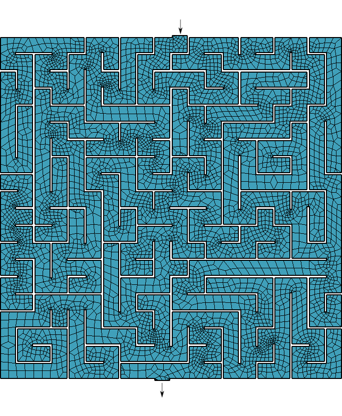

---
title: A free and open source computational tool to solve differential equations in the cloud
author: Jeremy Theler
email: jeremy@seamplex.com
aspectratio: 169
lang: en-US
theme: default
innertheme: rectangles
fonttheme: professionalfonts
outertheme: number
colorlinks: true
sansfont: Carlito
monofont: DejaVuSansMono
header-includes: \include{syntax.tex}
handout: true
...

## Background 1/2


 * 2007 Fuzzy logic & chaotic natural convection loops @ IB
 * 2008 Instabilities in the coupled neutronic-thermal-hydraulic problem @ IB
 * 2008 TECNA---CNA2
 * 2009 First attempt at PhD---v1
 * 2010 Paper on stability of point kinetics @ Nuc. Eng. & Design
 * 2010 First presentation of milonga at AATN
 * 2011 First ME with milonga (mrivero) @ UBA
 * 2011 IMEF $\rightarrow$ milonga with FEM @ UBA 
 * 2012 Paper generalized boiling channel @ ENIEF
 * 2013 Monograph milonga FEM vs. FVM @ UBA
 * 2013 Paper unstructured grids for neutron diffusion

 
## Background 2/2

 * 2013 Doppler measurement @ CNA1---v2
 * 2014 Design basis @ ENIEF
 * 2014 Doppler measurement @ CNA2
 * 2015 Workshop milonga @ CAC
 * 2016 First PhD with milonga (vitor) @ Belo Horizonte
 * 2017 Fatigue for LTE @ CNE
 * 2018 Opportunity @ KAIST---second attempt at PhD
 * 2020 Remote courses---third attempt at PhD
 * 2021 FeenoX (v3)
 * 2021 Simulation courses @ UNICEN


 

## How do we write papers/reports/documents?

\newcommand{\good}{\textcolor{OliveGreen}{$\checkmark$}}
\newcommand{\bad}{\textcolor{red}{$\times$}}
\newcommand{\neutral}{\textcolor{DarkBlue}{$\sim$}}


:::::::::::::: {.columns}
::: {.column width="25%"}
\centering \onslide<1->{\includegraphics[height=2cm]{word}}
:::

::: {.column width="25%"}
\centering \onslide<3->{\includegraphics[height=2cm]{google_docs}}
:::

::: {.column width="25%"}
\centering \onslide<4->{\includegraphics[height=2cm]{markdown}}
:::

::: {.column width="25%"}
\centering \onslide<2->{\includegraphics[height=2cm]{tex}}
:::
::::::::::::::

\rowcolors{1}{black!10}{black!0}

 Feature                | \onslide<1->{Word}     |   \onslide<3->{Docs}     |  \onslide<4->{Markdown}    |  \onslide<2->{\TeX}
:-----------------------|:----------------------:|:------------------------:|:--------------------------:|:------------------------:
 Aesthetics             | \onslide<1->{\bad}     |   \onslide<3->{\bad}     |  \onslide<4->{\good}       |  \onslide<2->{\good}
 Convertibility         | \onslide<1->{\neutral} |   \onslide<3->{\neutral} |  \onslide<4->{\good}       |  \onslide<2->{\neutral}
 Traceability           | \onslide<1->{\bad}     |   \onslide<3->{\neutral} |  \onslide<4->{\good}       |  \onslide<2->{\good}
 Mobile-friendly        | \onslide<1->{\bad}     |   \onslide<3->{\good}    |  \onslide<4->{\good}       |  \onslide<2->{\bad}
 Collaborative          | \onslide<1->{\bad}     |   \onslide<3->{\good}    |  \onslide<4->{\good}       |  \onslide<2->{\neutral}
 Licensing/openness     | \onslide<1->{\bad}     |   \onslide<3->{\bad}     |  \onslide<4->{\good}       |  \onslide<2->{\good}
 Non-nerd friendly      | \onslide<1->{\good}    |   \onslide<3->{\good}    |  \onslide<4->{\neutral}    |  \onslide<2->{\bad}

 
 
 
## How do we do scientific/engineering computations?

:::::::::::::: {.columns}
::: {.column width="25%"}
\centering \onslide<1->{\includegraphics[height=2cm]{prepomax}}
:::

::: {.column width="25%"}
\centering \onslide<3->{\includegraphics[height=2cm]{caeplex}}
:::

::: {.column width="25%"}
\centering \onslide<4->{\includegraphics[height=2cm]{feenox-logo}}
:::

::: {.column width="25%"}
\centering \onslide<2->{\includegraphics[height=2cm]{libraries}}
:::
::::::::::::::

\rowcolors{1}{black!10}{black!0}

 Feature                | \onslide<1->{Desktop GUIs}         |   \onslide<3->{Web frontends} |  \onslide<4->{FeenoX}      |  \onslide<2->{Libraries}
:-----------------------|:----------------------------------:|:-----------------------------:|:--------------------------:|:-----------------------------:
 Flexibility            | \onslide<1->{\neutral}             |   \onslide<3->{\bad}          |  \onslide<4->{\good}       |  \onslide<2->{\good}
 Scalability            | \onslide<1->{\bad}                 |   \onslide<3->{\neutral}      |  \onslide<4->{\good}       |  \onslide<2->{\good}
 Traceability           | \onslide<1->{\bad}                 |   \onslide<3->{\neutral}      |  \onslide<4->{\good}       |  \onslide<2->{\good}
 Cloud-friendly         | \onslide<1->{\bad}                 |   \onslide<3->{\good}         |  \onslide<4->{\good}       |  \onslide<2->{\good}
 Collaborative          | \onslide<1->{\bad}                 |   \onslide<3->{\good}         |  \onslide<4->{\neutral}    |  \onslide<2->{\bad}
 Licensing/openness     | \onslide<1->{\good/\neutral/\bad}  |   \onslide<3->{\bad}          |  \onslide<4->{\good$^*$}   |  \onslide<2->{\good}
 Non-nerd friendly      | \onslide<1->{\good}                |   \onslide<3->{\good}         |  \onslide<4->{\neutral}    |  \onslide<2->{\bad}
 
\onslide<4->{\centering $^*$ FeenoX is GPLv3+, i.e. “libre" or free as in “free speech”}


## Software Requirement Specifications

A fictitious & imaginary Request for Quotation for a computational tool:

:::::::::::::: {.columns}
::: {.column width="35%"}

 1. Introduction
    * 1.1. Objective
    * 1.2. Scope
 2. Architecture
    * 2.1. Deployment
    * 2.2. Execution
    * 2.3. Efficiency
    * 2.4. Scalability
    * 2.5. Flexibility
    * 2.6. Extensibility
    * 2.7. Interoperability
:::

::: {.column width="50%"}

 3. Interfaces
    * 3.1. Problem input
    * 3.2. Results output
 4. Quality assurance
    * 4.1. Reproducibility and traceability 
    * 4.2. Automated testing
    * 4.3. Bug reporting and tracking
    * 4.4. Verification
    * 4.5. Validation
    * 4.6. Documentation
:::
::::::::::::::


### FeenoX Software Design Specifications {.example}

 * A fictitious & imaginary tender applying to the SRS addressing each section.


## 

:::::::::::::: {.columns}
:::::: {.column width="50%"}

### 1. Introduction

 * Application to industrial problems
   - Open source (to allow third-party V&V)
 * First basic version should some problems
 * It should be extensible to other formulations 
   - Free (as in freedom to hire somebody to extend it)

#### 1.1. Objective

 * Solve DAEs and/or PDEs
    - Heat conduction
    - Elasticity
    - Electromagnetism
    - Fluid mechanics
    - ...
 * State-of-the-art cloud friendly

::::::

. . .

:::::: {.column width="50%"}

### FeenoX {.example}
 * Free as “software libre”
    * GPLv3+
    * Only FOSS dependencies
    * Main target is `linux-x86_64`
    * Development environment is Debian
\medskip

 * Initial version supports (v1 & v2)
   * Dynamical systems (DAE)
   * Laplace/Poisson/Helmholtz (FEM)
   * Heat (FEM)
   * Elasticity (FEM)
   * Modal (FEM)
   * Neutron transport and diffusion (FEM/FVM)
 * Template for more formulations
   * Electromagnetism
   * Chemical diffusion/reaction
   * Fluid mechanics?

::::::
::::::::::::::
 
 
## 

:::::::::::::: {.columns}
::: {.column width="50%"}

#### 1.2. Scope

 * The problem should be defined progamatically
   - One or more input files (JSON, YAML, ad-hoc format), and/or
   - An API for high-level language (Python, Julia, etc.)
 * There is no need to _include_ a GUI
   - The tool should _allow_ a GUI to be used
     - desktop
     - web
     - mobile
 * The discretization of the domain can be an input
   - As long as its creation meets the SRS
 * Include documentation about how a...
   - Pre-processor should create inputs
   - Post-processor should read outputs

:::

::: {.column width="50%"}

### FeenoX {.example}

 * xxx


:::
::::::::::::::


 
 

## 

:::::::::::::: {.columns}
::: {.column width="50%"}

### 2. Architecture

 * Should run on mainstream cloud servers
   - GNU/Linux
   - Multi-core Intel-compatible CPUs
   - Several levels of memory cache
   - A few Gb of RAM
   - Several Gb of SSD
   - Either
     - Bare metal
     - Virtualized
     - Containerized
 * Standard compilers, libraries and dependencies
   - Available in common GNU/Linux repositories
   - Preferable 100% open source
   - Adhere to well-established standards

:::

::: {.column width="50%"}

### FeenoX {.example}

 * xxx


:::
::::::::::::::

 
## 

:::::::::::::: {.columns}
::: {.column width="50%"}

### 2. Architecture

 * Small coarse problems should be run in single hosts to check inputs
    - Local desktop/laptops (not needed but suggested)
    - Windows and MacOS  (not needed but suggested)
    - Small cloud instances
 * Large actual problems should be split in several hosts
    - HPC clusters
    - Scalable cloud instances
 * Mobile devices (not needed but suggested)
    - As control/monitoring devices
:::

::: {.column width="50%"}

### FeenoX {.example}
 * xxx


:::
::::::::::::::


## 

:::::::::::::: {.columns}
::: {.column width="50%"}

#### 2.1. Deployment

 * Automatically compile from source
    - Particular optimization flags
 * Availability of pre-compiled binaries
    - Common architectures and options
 * Both of them have to be available online

#### 2.2. Execution

 * Remote execution, either
    - By a direct user action
    - From a higher-level workflow
 * Outer loops have to be supported
    - scripted
    - parametric
    - optimization
 * Ways to read data from the outer loop
 * Ways to write scalar figures of merit
 
:::

::: {.column width="50%"}

### FeenoX {.example}

 * xxx


:::
::::::::::::::


## 

:::::::::::::: {.columns}
::: {.column width="50%"}

#### 2.3. Efficiency

 * Similar to to other tools in terms of
    - CPU/GPU
    - RAM
    - storage

#### 2.4. Scalability

 * Small problems to check correctness
 * Large problems in parallel
    - Reasonable weak & strong scalability
    
#### 2.5. Flexibility

 * Engineering problems with
    - Multiple materials
    - Space-dependent properties
    - Space & time-dependent BCs
 * Handle point-wise data
    - Properties
    - Time-dependent scalars
    
:::

::: {.column width="50%"}

### FeenoX {.example}

 * xxx


:::
::::::::::::::


## 

:::::::::::::: {.columns}
::: {.column width="50%"}

#### 2.6. Extensibility

 * xxx
 
#### 2.7. Interoperability

 * xxx
    
:::

::: {.column width="50%"}

### FeenoX {.example}

 * xxx


:::
::::::::::::::


## 

:::::::::::::: {.columns}
::: {.column width="50%"}

### 3. Interfaces

#### 3.1. Input

 * xxx
 
#### 3.2. Output

 * xxx
    
:::

::: {.column width="50%"}

### FeenoX {.example}

 * xxx


:::
::::::::::::::


## 

:::::::::::::: {.columns}
::: {.column width="50%"}

### 4. Quality Assurance

#### 4.1. Reproducibility and traceability

 * xxx
 
#### 4.2. Automated testing

 * xxx

#### 4.3. Bug reporting and tracking

 * xxx
 
:::

::: {.column width="50%"}

### FeenoX {.example}

 * xxx


:::
::::::::::::::


## 

:::::::::::::: {.columns}
::: {.column width="50%"}

#### 4.4. Verification

 * xxx
 
#### 4.5. Validation

 * xxx

#### 4.6. Documentation

 * xxx
 
:::

::: {.column width="50%"}

### FeenoX {.example}

 * xxx


:::
::::::::::::::


## Design

 0. Third-attempt!
    * see “ancient history” appendix for details

 1. UNIX philosophy: do one thing well

    * no GUI
    * glue layer
    * separate mesher
       * Gmsh
    * third-party mathematical libraries
       * PETSc (LAPACK, MUMPS, HYPRE, MKL, ...)
       * SLEPc
       * SUNDIALS
       * GSL
    * outer loops (i.e. parametric, optimization) with third-party tools
 
 
 3. Transfer function
    * input/output files
    * no need to recompile
 
 4. English-like syntactic-sugared plain-text input files
    * nouns are definitions, verbs are instructions
    * simple problems ought to need simple inputs
    * similar problems ought to need similar inputs
    * robust (`thermal` or `heat`)
 
 5. Cloud
    * unattended execution
    * docker-friendly deployment
       - git clone from Github
       - source tarballs
       - binary tarballs
    * ability to report status
    * parallelization through MPI
    
 
 6. GUI-friendly
    * specially web-based interfaces
    * already powering [caeplex.com]<https:://www.caeplex.com>

 7. Written in C (no C++ nor Fortran)
    * C99
    * uses Autotools
    * tested with `gcc`, `clang` and `icc`
    * no need for C++ nor Fortran compilers
    * Rust & Go, can't tell (yet)

 8. Python & Julia API
    
 9. Extensibility
    * use the existing PDE formulations as templates
    * build a community!

## Three ways of getting the first 25 Fibonacci numbers

:::::::::::::: {.columns}
::: {.column width="70%"}
```{.feenox include="math/fibo_vector.fee"}
```

```{.feenox include="math/fibo_formula.fee"}
```

```{.feenox include="math/fibo_iterative.fee"}
```
:::

::: {.column width="30%"}
```terminal
$ feenox fibo_formula.fee
1       1
2       1
3       2
4       3
5       5
6       8
7       13
8       21
9       34
10      55
11      89
12      144
13      233
14      377
15      610
16      987
17      1597
18      2584
19      4181
20      6765
21      10946
22      17711
23      28657
24      46368
25      75025
$
```
:::
::::::::::::::


## Lorenz’ system

:::::::::::::: {.columns}
::: {.column width="45%"}

Solve
$$
\begin{cases}
\dot{x} &= \sigma \cdot (y - x) \\
\dot{y} &= x \cdot (r - z) - y \\
\dot{z} &= x \cdot y - b \cdot z
\end{cases}
$$

\noindent for $0 < t < 40$ with initial conditions

$$
\begin{cases}
x(0) &= -11\\
y(0) &= -16\\
z(0) &= 22.5\\
\end{cases}
$$

\noindent and $\sigma=10$, $r=28$ and $b=8/3$.
:::

::: {.column width="55%"}
```{.feenox include="lorenz/lorenz.fee"}
```

```terminal
$ feenox lorenz.fee
aasdfas df asdf
[...]
$
```

:::
::::::::::::::

## 

\centering 

## Point kinetics as ODEs

:::::::::::::: {.columns}
::: {.column width="45%"}

$$
\begin{cases}
\dot{\phi}(t) &= \displaystyle \frac{\rho(t) - \Beta}{\Lambda} \cdot \phi(t) + \sum_{i=1}^{N} \lambda_i \cdot c_i \\
\dot{c}_i(t)  &= \displaystyle \frac{\beta_i}{\Lambda} \cdot \phi(t) - \lambda_i \cdot c_i
\end{cases}
$$

\vspace{-0.5cm}

 $t$ [s] | $\rho(t)$ [pcm]
--------:|-----------:
 0       |  0
 5       |  0
 10      | 10
 30      | 10
 35      |  0
 100     |  0 

\vspace{-0.5cm}

\noindent for $0 < t < 100$ starting from steady-steate conditions at full power.
:::

::: {.column width="55%"}
```{.feenox include="kinetics/reactivity-from-table.fee"}
```
:::
::::::::::::::

## 

\centering 


## Inverse kinetics as a DAEs

## Traditional integral-based inverse kinetics

## Point kinetics as reactivity-dependent-frequency lags

## How to solve a maze without AI

\renewcommand{\vec}{\mathbf}

\centering {height=8cm}


## 

:::::::::::::: {.columns}
::: {.column width="50%"}
{width=6cm}\ 

Mesh it, set $\phi=0$ at start, $\phi=1$ at end, $\nabla \phi \cdot \hat{\vec{n}} = 0$ otherwise and solve $\nabla^2 \phi = 0$
:::

. . .

::: {.column width="50%"}

{width=6cm}\ 

Go to start and follow the gradient $\nabla \phi$!
:::
::::::::::::::

 

## Ancient history

 * 2006: Matlab & point kinetics (Dr.\ Etchepareborda)
 * 2006--2007: melon (& meloncito) for fuzzy control @ CABLCB
 * 2007--2008: point kinetics with TH feeback @ CABLCB
 * 2009: v1
    * wasora
    * colach
    * mochin
    * milonga
 * 2012: v2 (with optimization, it even had SIMAN & GA)
    * wasora
    * Fino
    * milonga
    * pywas
    * relap/dynetz
 * 2021: v3 (UNIX & cloud)
    * FeenoX
     
 
 
 
