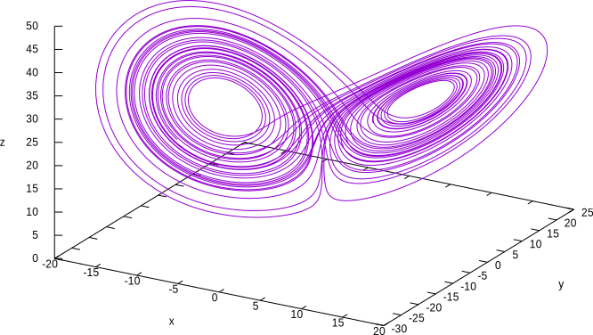
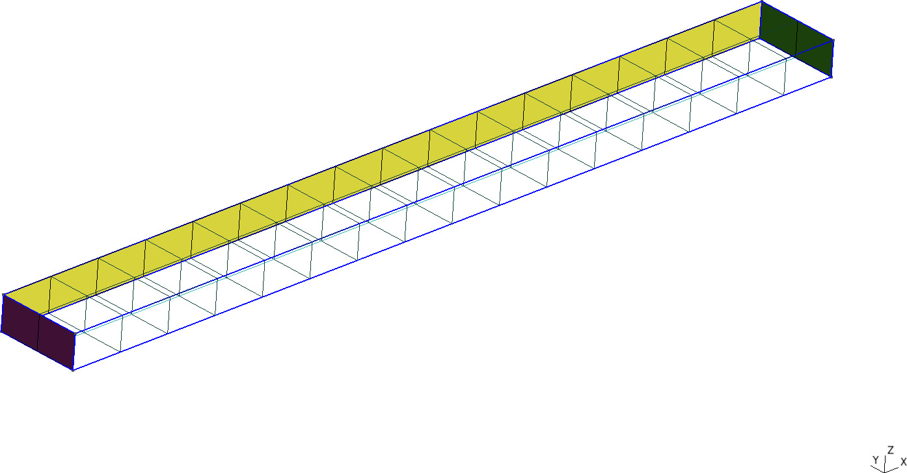
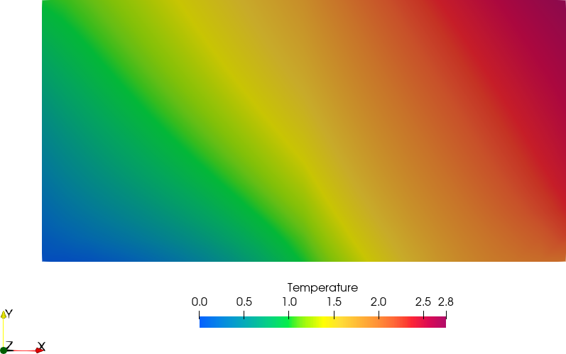
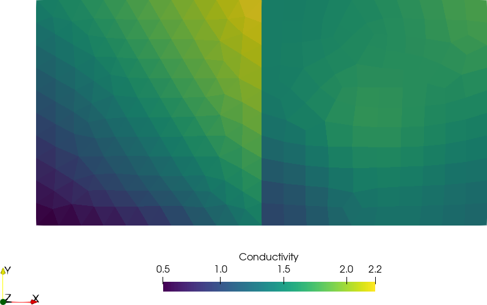
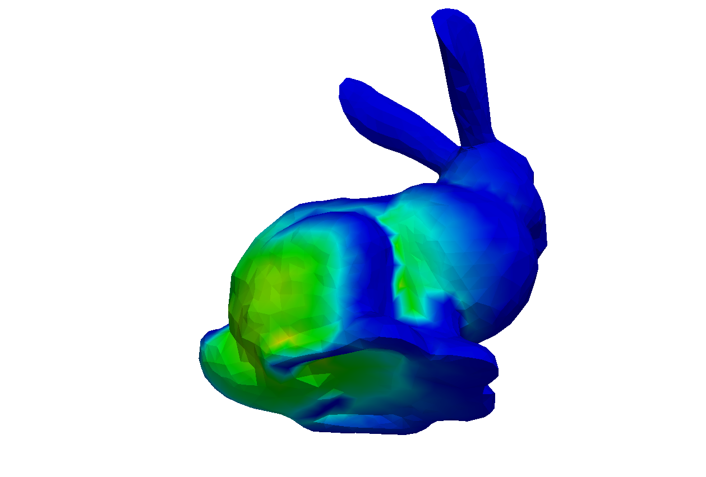
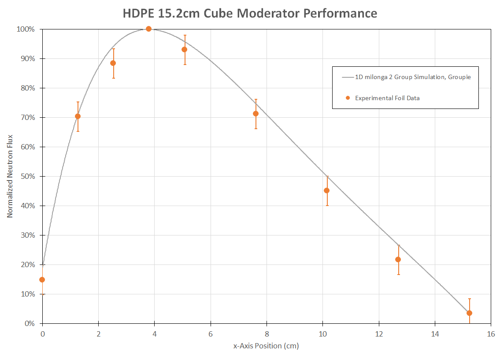

## How do we write papers/reports/documents?

<div class="columns">

<div class="column" width="25%">

</div>

<div class="column" width="25%">

</div>

<div class="column" width="25%">

</div>

<div class="column" width="25%">

</div>

</div>

| Feature               |     |     |     |     |
|:----------------------|:---:|:---:|:---:|:---:|
| Aesthetics            |     |     |     |     |
| Convertibility        |     |     |     |     |
| Traceability          |     |     |     |     |
| Mobile-friendliness   |     |     |     |     |
| Collaborative         |     |     |     |     |
| Licensing/openness    |     |     |     |     |
| Non-nerd friendliness |     |     |     |     |

## How do we do scientific/engineering computations?

<div class="columns">

<div class="column" width="25%">

</div>

<div class="column" width="25%">

</div>

<div class="column" width="25%">

</div>

<div class="column" width="25%">

</div>

</div>

| Feature               |     |     |     |     |
|:----------------------|:---:|:---:|:---:|:---:|
| Flexibility           |     |     |     |     |
| Scalability           |     |     |     |     |
| Traceability          |     |     |     |     |
| Cloud-friendliness    |     |     |     |     |
| Collaborative         |     |     |     |     |
| Licensing/openness    |     |     |     |     |
| Non-nerd friendliness |     |     |     |     |

## Software Requirement Specifications

After a successful project with a foreign company I decided to structure
the PhD based on a fictitious & imaginary “Request for Quotation” for a
computational tool:

<div class="columns">

<div class="column" width="35%">

1.  Introduction
    -   1.1. Objective
    -   1.2. Scope
2.  Architecture
    -   2.1. Deployment
    -   2.2. Execution
    -   2.3. Efficiency
    -   2.4. Scalability
    -   2.5. Flexibility
    -   2.6. Extensibility
    -   2.7. Interoperability

</div>

<div class="column" width="50%">

3.  Interfaces
    -   3.1. Problem input
    -   3.2. Results output
4.  Quality assurance
    -   4.1. Reproducibility and traceability
    -   4.2. Automated testing
    -   4.3. Bug reporting and tracking
    -   4.4. Verification
    -   4.5. Validation
    -   4.6. Documentation

</div>

</div>

### FeenoX Software Design Specifications

-   A fictitious & imaginary tender applying to the SRS addressing each
    section.

## 

<div class="columns">

<div class="column" width="50%">

### 1. Introduction

-   Application to industrial problems
    -   Open source (to allow third-party V&V)
-   First version should handle some problems
-   Extensible to other problems & formulations
    -   Free (as in freedom to hire somebody to modify/extend it)

#### 1.1. Objective

-   Solve DAEs and/or PDEs
    -   Heat conduction
    -   Elasticity
    -   Electromagnetism
    -   Fluid mechanics
    -   …
-   State-of-the-art cloud friendly

</div>

. . .

<div class="column" width="50%">

### FeenoX

-   Free as “software libre”
    -   GPLv3+
    -   Only FOSS dependencies
    -   Main target is `linux-x86_64`
    -   Development environment is Debian
-   Initial version supports
    -   Dynamical systems (DAE)
    -   Laplace/Poisson/Helmholtz (FEM)
    -   Heat (FEM)
    -   Elasticity (FEM)
    -   Modal (FEM)
    -   Neutron transport and diffusion (FEM/FVM)
-   Templates for more formulations
    -   Electromagnetism
    -   Chemical diffusion/reaction
    -   Fluid mechanics?

</div>

</div>

## 

<div class="columns">

<div class="column" width="50%">

#### 1.2. Scope

-   The problem should be defined programatically
    -   One or more input files (JSON, YAML, ad-hoc format), and/or
    -   An API for high-level language (Python, Julia, etc.)
-   There is no need to *include* a GUI
    -   The tool should *allow* a GUI to be used
        -   Desktop
        -   Web
        -   Mobile
-   The mesh can be an input
    -   As long as its creation meets the SRS
-   Include documentation about how a…
    -   Pre-processor should create inputs
    -   Post-processor should read outputs

</div>

. . .

<div class="column" width="50%">

### FeenoX

-   No GUI, console binary executable
-   “Transfer-function”-like between I/O
    -   No need to recompile the binary

         
-   English-like syntactic-sugared input files
    -   Nouns are definitions
    -   Verbs are instructions
-   Python & Julia API:
    -   But already taken into account in the design & implementation
-   Separate mesher
    -   [Gmsh](http://gmsh.info/) (GPLv2, meets SRS)
    -   Anything that writes `.msh`
-   Possibility to use GUI
    -   CAEplex <https://www.caeplex.com>

</div>

</div>

## Transfer-function & English-like input: Lorenz’ system

<div class="columns">

<div class="column" width="45%">

Solve
$$
\\begin{cases}
\\dot{x} = \\sigma \\cdot (y - x) \\\\
\\dot{y} = x \\cdot (r - z) - y \\\\
\\dot{z} = x y - b z
\\end{cases}
$$

for 0 \< *t* \< 40 with initial conditions

$$
\\begin{cases}
x(0) = -11\\\\
y(0) = -16\\\\
z(0) = 22.5\\\\
\\end{cases}
$$

and *σ* = 10, *r* = 28 and *b* = 8/3.

</div>

. . .

<div class="column" width="55%">

``` feenox
PHASE_SPACE x y z
end_time = 40         # dimensionless time

sigma = 10            # parameters
r = 28
b = 8/3

x_0 = -11             # initial conditions
y_0 = -16
z_0 = 22.5

# Lorenz's equations as written in 1963
x_dot = sigma*(y - x)
y_dot = x*(r - z) - y
z_dot = x*y - b*z

PRINT %e t x y z      # four-column plain-ASCII output
```

``` terminal
$ feenox lorenz.fee
0.000000e+00    -1.100000e+01   -1.600000e+01   2.250000e+01
2.384186e-07    -1.100001e+01   -1.600001e+01   2.250003e+01
4.768372e-07    -1.100002e+01   -1.600002e+01   2.250006e+01
[...]
3.997567e+01    4.442995e+00    3.764391e+00    2.347301e+01
3.998290e+01    4.399950e+00    3.886609e+00    2.314602e+01
3.999012e+01    4.368713e+00    4.016860e+00    2.282821e+01
$
```

</div>

</div>

## Lorenz’ system



## Web interface: CAEplex, finite elements in the cloud


<https://www.seamplex.com/feenox/videos/caeplex-ipad.mp4>

<https://www.caeplex.com>

## 

<div class="columns">

<div class="column" width="50%">

### 2. Architecture

-   Should run on mainstream cloud servers
    -   GNU/Linux
    -   Multi-core Intel-compatible CPUs
    -   Several levels of memory cache
    -   A few Gb of RAM
    -   Several Gb of SSD
    -   Either
        -   Bare metal
        -   Virtualized
        -   Containerized
-   Standard compilers, libraries and dependencies
    -   Available in common GNU/Linux repositories
    -   Preferable 100% open source
    -   Adhere to well-established standards

</div>

. . .

<div class="column" width="50%">

### FeenoX

-   Third-system effect (after v1 & v2)

-   philosophy: “do one thing well”

    -   : no GUI
    -   : Gnuplot, Gmsh, …
    -   …more rules to come!

-   Third-party math libraries

    -   GNU GSL, PETSc, SLEPc, SUNDIALS

    -   

-   Dependencies available in APT

    ``` terminal
    apt-get install git gcc make automake autoconf
    apt-get install libgsl-dev
    apt-get install lib-sundials-dev petsc-dev slepc-dev
    ```

-   Sources on
    [github.com/seamplex/feenox](https://github.com/seamplex/feenox)

    ``` terminal
    git clone https://github.com/seamplex/feenox
    ```

-   Autotools & friends for compilation

    ``` terminal
    ./autogen.sh && ./configure && make
    ```

</div>

</div>

## 

<div class="columns">

<div class="column" width="50%">

### 2. Architecture

-   Small coarse problems should be run in single hosts to check inputs
    -   Local desktop/laptops (not needed but suggested)
    -   Windows and MacOS (not needed but suggested)
    -   Small cloud instances
-   Large actual problems should be split into several hosts
    -   HPC clusters
    -   Scalable cloud instances
-   Mobile devices (not needed but suggested)
    -   As control/monitoring devices

</div>

. . .

<div class="column" width="50%">

### FeenoX

-   Tested on

    -   Raspberry Pi
    -   Laptop (GNU/Linux & Windows 10)
    -   Macbook
    -   Desktop PC
    -   Bare-metal servers
    -   Vagrant/Virtualbox
    -   Docker/Kubernetes
    -   AWS/DigitalOcean/Contabo

-   Parallelization:

    -   Gmsh partitioning with METIS
    -   PETSc/SLEPc with MPI

-   Web: <https://www.caeplex.com> (v2)

      
    

-   Mobile:

</div>

</div>

## How to solve a maze without AI 1/3

<div class="columns">

<div class="column" width="50%">


</div>

<div class="column" width="50%">


1.  Go to <http://www.mazegenerator.net/>
2.  Create a maze
3.  Download it in PNG
4.  Perform some conversions
    -   PNG → PNM → SVG → DXF → GEO

    ``` terminal
    $ wget http://www.mazegenerator.net/static/orthogonal_maze_with_20_by_20_cells.png
    $ convert orthogonal_maze_with_20_by_20_cells.png \ 
      -negate maze.png
    $ potrace maze.pnm --alphamax 0  --opttolerance 0 \ 
      -b svg -o maze.svg
    $ ./svg2dxf maze.svg maze.dxf
    $ ./dxf2geo maze.dxf 0.1
    ```

</div>

</div>

## How to solve a maze without AI 2/3

<div class="columns">

<div class="column" width="50%">

5.  Open it with Gmsh

     

    -   Add a surface
    -   Set physical curves for “start” and “end”

6.  Mesh it

    ``` terminal
    gmsh -2 maze.geo
    ```

</div>

<div class="column" width="50%">

</div>

</div>

## How to solve a maze without AI 3/3

<div class="columns">

<div class="column" width="50%">

7.  Solve ∇<sup>2</sup>*ϕ* = 0 with BCs
    $$
    \\begin{cases}
    \\phi=0 & \\text{at “start”} \\\\
    \\phi=1 & \\text{at “end”} \\\\
    \\nabla \\phi \\cdot \\hat{\\mathbf{n}} = 0 & \\text{everywhere else} \\\\
    \\end{cases}
    $$

    ``` feenox
    PROBLEM laplace 2D  # pretty self-descriptive, isn't it?
    READ_MESH maze.msh

    # boundary conditions (default is homogeneous Neumann)
    BC start  phi=0 
    BC end    phi=1

    SOLVE_PROBLEM

    # write the norm of gradient as a scalar field
    # and the gradient as a 2d vector into a .msh file
    WRITE_MESH maze-solved.msh \
        sqrt(dphidx(x,y)^2+dphidy(x,y)^2) \
        VECTOR dphidx dphidy 0 
    ```

    ``` terminal
    $ feenox maze.fee
    $
    ```

8.  Go to start and follow the gradient ∇*ϕ*!

</div>

<div class="column" width="50%">

</div>

</div>

## The life of an influencer…

<div class="columns">

<div class="column" width="50%">


</div>

<div class="column" width="50%">

<http://www.mazegenerator.net/Examples.aspx>

<!-- \centering {width=45%} -->


</div>

</div>

## 

<div class="columns">

<div class="column" width="50%">

#### 2.1. Deployment

-   Automatically compile from source
    -   Particular optimization flags
-   Availability of pre-compiled binaries
    -   Common architectures and options
-   Both of them have to be available online

#### 2.2. Execution

-   Remote execution, either
    -   By a direct user action
    -   From a higher-level workflow
-   Outer loops have to be supported
    -   scripted
    -   parametric
    -   optimization
-   Ways to read data from the outer loop
-   Ways to write scalar figures of merit

</div>

. . .

<div class="column" width="50%">

### FeenoX

-   Compile optimized dependencies

    ``` terminal
    $ cd $PETSC_DIR
    $ export PETSC_ARCH=linux-fast
    $ ./configure --with-debug=0 COPTFLAGS="-Ofast"
    $ make -j8
    ```

-   Configure FeenoX with particular flags

    ``` terminal
    $ git clone https://github.com/seamplex/feenox
    $ cd feenox
    $ ./autogen.sh
    $ export PETSC_ARCH=linux-fast
    $ ./configure MPICH_CC=clang CFLAGS=-Ofast
    $ make -j8
    # make install
    ```

-   Or use pre-compiled binaries

    ``` terminal
    wget http://gmsh.info/bin/Linux/gmsh-Linux64.tgz
    wget https://seamplex.com/feenox/dist/linux/feenox-linux-amd64.tar.gz
    ```

-   Everything is Docker-friendly

-   Execution examples follow →

</div>

</div>

## Direct execution: three ways of getting the first 20 Fibonacci numbers

<div class="columns">

<div class="column" width="60%">

``` feenox
# the Fibonacci sequence using the closed-form formula as a function
phi = (1+sqrt(5))/2 
f(n) = (phi^n - (1-phi)^n)/sqrt(5)
PRINT_FUNCTION f MIN 1 MAX 20 STEP 1
```

. . .

``` feenox
# the fibonacci sequence as a vector
VECTOR f SIZE 20

f[i]<1:2> = 1
f[i]<3:vecsize(f)> = f[i-2] + f[i-1]

PRINT_VECTOR i f
```

. . .

``` feenox
# the fibonacci sequence as an iterative problem

static_steps = 20
#static_iterations = 1476  # limit of doubles

IF step_static=1|step_static=2
 f_n = 1
 f_nminus1 = 1
 f_nminus2 = 1
ELSE
 f_n = f_nminus1 + f_nminus2
 f_nminus2 = f_nminus1
 f_nminus1 = f_n
ENDIF

PRINT step_static f_n
```

</div>

. . .

<div class="column" width="40%">

``` terminal
$ feenox fibo_formula.fee | tee one
1   1
2   1
3   2
4   3
5   5
6   8
7   13
8   21
9   34
10  55
11  89
12  144
13  233
14  377
15  610
16  987
17  1597
18  2584
19  4181
20  6765
$ feenox fibo_vector.fee > two
$ feenox fibo_iterative.fee > three
$ diff one two
$ diff two three
$
```

</div>

</div>

## Parametric execution: shear locking in cantilevered beam

<div class="columns">

<div class="column" width="60%">

``` bash
#!/bin/bash

rm -f *.dat
for element in tet4 tet10 hex8 hex20 hex27; do
 for c in $(seq 1 10); do
 
  # create mesh if not alreay cached
  mesh=cantilever-${element}-${c}
  if [ ! -e ${mesh}.msh ]; then
    scale=$(echo "PRINT 1/${c}" | feenox -)
    gmsh -3 -v 0 cantilever-${element}.geo -clscale ${scale} -o ${mesh}.msh
  fi
  
  # call FeenoX
  feenox cantilever.fee ${element} ${c} | tee -a cantilever-${element}.dat
  
 done
done
```

``` feenox
PROBLEM elastic 3D
READ_MESH cantilever-$1-$2.msh   # in meters

E = 2.1e11         # Young modulus in Pascals
nu = 0.3           # Poisson's ratio

BC left   fixed
BC right  tz=-1e5  # traction in Pascals, negative z
 
SOLVE_PROBLEM

# z-displacement (components are u,v,w) at the tip vs. number of nodes
PRINT nodes w(500,0,0) "\# $1 $2"
```

</div>

<div class="column" width="40%">




-   -   Only one material, no need to link volumes with materials

    ``` feenox
    E = 2.1e11   # Young modulus in Pa
    ```

</div>

</div>

## Parametric execution: shear locking in cantilevered beam


## Optimization loop: finding the right length of a tuning fork

<div class="columns">

<div class="column" width="20%">


ℓ<sub>1</sub> to have 440 Hz?

</div>

. . .

<div class="column" width="40%">

``` python
import math
import gmsh
import subprocess  # to call FeenoX and read back

def create_mesh(r, w, l1, l2, n):
  gmsh.initialize()
  ...
  gmsh.finalize()
  return len(nodes)
  
def main():
  target = 440    # target frequency
  eps = 1e-2      # tolerance
  r = 4.2e-3      # geometric parameters
  w = 3e-3
  l1 = 30e-3
  l2 = 60e-3

  for n in range(1,7):   # mesh refinement level
    l1 = 60e-3              # restart l1 & error
    error = 60
    while abs(error) > eps:   # loop
      l1 = l1 - 1e-4*error
      # mesh with Gmsh Python API
      nodes = create_mesh(r, w, l1, l2, n)
      # call FeenoX and read scalar back
      # TODO: FeenoX Python API (like Gmsh)
      result = subprocess.run(['feenox', 'fork.fee'], stdout=subprocess.PIPE)
      freq = float(result.stdout.decode('utf-8'))
      error = target - freq
    
    print(nodes, l1, freq)
```

</div>

<div class="column" width="40%">

``` feenox
PROBLEM modal 3D MODES 1  # only one mode needed
READ_MESH fork.msh  # in [m]
E = 2.07e11         # in [Pa]
nu = 0.33
rho = 7829          # in [kg/m^2]

# no BCs! It is a free-free vibration problem
SOLVE_PROBLEM

# write back the fundamental frequency to stdout
PRINT f(1)
```

. . .

``` terminal
$ python fork.py > fork.dat
$
```


</div>

</div>

## 

<div class="columns">

<div class="column" width="47.5%">

#### 2.3. Efficiency

-   Similar to to other tools in terms of
    -   CPU/GPU
    -   RAM
    -   Storage

#### 2.4. Scalability

-   Small problems to check correctness
-   Large problems in parallel
    -   Reasonable weak & strong scalability

#### 2.5. Flexibility

-   Engineering problems with
    -   Multiple materials
    -   Space-dependent properties
    -   Space & time-dependent BCs
-   Handle point-wise data
    -   Properties
    -   Time-dependent scalars

</div>

. . .

<div class="column" width="52.5%">

### FeenoX

-   First make it work, then optimize
    -   
-   Premature optimization is the root of all evil
    -   Optimization:
    -   Parallelization:
    -   Comparison:
-   Linear solvers
    -   Direct solver MUMPS
        -   Robust but not scalable
    -   GAMG-preconditioned KSP
        -   Near-nullspace improves convergence
-   Non-linear & transient solvers
    -   Scalable as PETSc
-   Written in ANSI C99 (no C++ nor Fortran)
    -   Autotools & friends, POSIX

    -   Tested with `gcc`, `clang` and `icc`

    -   Rust & Go, can’t tell (yet)

    -   
-   Flexibility follows →

</div>

</div>

## Flexibility I: one-dimensional thermal slab

<div class="columns">

<div class="column" width="45%">

Solve heat conduction on the slab *x* ∈ \[0:1\] with boundary conditions

$$
\\begin{cases}
T(0) = 0 & \\text{(left)} \\\\
T(1) = 1 & \\text{(right)} \\\\
\\end{cases}
$$

and uniform conductivity. Compute $T\\left(\\frac{1}{2}\\right)$.

. . .

-   English self-evident ASCII input
    -   Syntactic sugar
    -   Simple problems, simple inputs
    -   Robust (`heat` or `thermal`)
-   Mesh separated from problem
    -   Git-friendly `.geo` & `.fee`
-   Output is 100% user-defined
    -   No `PRINT` no output

    -   
-   There is no node at *x* = 1/2 = 0.5!

</div>

<div class="column" width="55%">

``` c
Point(1) = {0, 0, 0};          // geometry: 
Point(2) = {1, 0, 0};          // two points
Line(1) = {1, 2};              // and a line connecting them!

Physical Point("left") = {1};  // groups for BCs and materials
Physical Point("right") = {2};
Physical Line("bulk") = {1};   // needed due to how Gmsh works

Mesh.MeshSizeMax = 1/3;        // mesh size, three line elements
Mesh.MeshSizeMin = Mesh.MeshSizeMax;
```

``` feenox
PROBLEM thermal 1D    # tell FeenoX what we want to solve 
READ_MESH slab.msh    # read mesh in Gmsh's v4.1 format
k = 1                 # set uniform conductivity
BC left  T=0          # set fixed temperatures as BCs
BC right T=1          # "left" and "right" are defined in the mesh
SOLVE_PROBLEM         # we are ready to solve the problem
PRINT T(1/2)          # ask for the temperature at x=1/2
```

``` terminal
$ gmsh -1 slab.geo
[...]
Info    : 4 nodes 5 elements
Info    : Writing 'slab.msh'...
[...]
$ feenox thermal-1d-dirichlet-uniform-k.fee 
0.5
$ 
```

</div>

</div>

## Flexibility II: one-dimensional thermal slabs

<div class="columns">

<div class="column" width="45%">

``` feenox
PROBLEM heat 1D
READ_MESH slab.msh

BC left  T=0
BC right T=1

INCLUDE $1.fee   # read k and solution from $1

SOLVE_PROBLEM

PRINT_FUNCTION T T_analytical MIN 0 MAX 1 NSTEPS 100
```

``` feenox
k = 1            # uniform.fee
T_analytical(x) = x
```

``` feenox
k(x) = 1+x       # space.fee
T_analytical(x) = log(1+x)/log(2)
```

``` feenox
a = 2            # temperature.fee
k(x) = 1+a*T(x)
T_analytical(x) = (1/a)*(sqrt(1+(2+a)*a*x)-1)
```

. . .

-   Everything is an expression
-   Similar problems need similar inputs
-   : *k*(*x*) = 1 + *x*

</div>

<div class="column" width="55%">

``` bash
for i in uniform space temperature; do
  feenox thermal-1d-dirichlet.fee ${i} > ${i}.dat
done
```

<embed src="thermal-slabs.pdf" style="width:75.0%" />

-   FeenoX can tell that *k*(*T*) is non-linear
    -   It switchs from
        [`KSP`](https://petsc.org/release/docs/manual/ksp/) to
        [`SNES`](https://petsc.org/release/docs/manual/snes/)

</div>

</div>

## Flexibility III: two squares in thermal contact

<div class="columns">

<div class="column" width="50%">


``` feenox
PROBLEM thermal 2d
READ_MESH two-squares.msh

FUNCTION cond(x,y) INTERPOLATION shepard DATA {
    1   0    1.0
    1   1    1.5
    2   0    1.3
    2   1    1.8
    1.5 0.5  1.7 }

#        name   conductivity  power density
MATERIAL yellow k=0.5+T(x,y)  q=0
MATERIAL cyan   k=cond(x,y)   q=1-0.2*T(x,y)
    
BC left   T=y              # temperature
BC bottom T=1-cos(pi/2*x)
BC right  q=2-y            # heat flux
BC top    q=1

SOLVE_PROBLEM
 
WRITE_MESH two-squares.vtk  T CELLS k
```

</div>

. . .

<div class="column" width="50%">





-   Volumes ⇔ materials now needed
-   FeenoX detects the problem is non-linear
-   : roughish output

</div>

</div>

## Flexibility IV: thermal transient with time-dependent BCs

<div class="columns">

<div class="column" width="50%">


</div>

. . .

<div class="column" width="50%">

``` feenox
# NAFEMS-T3 benchmark: 1d transient heat conduction
PROBLEM heat DIMENSIONS 1
READ_MESH slab-0.1m.msh

T_0(x) = 0         # initial condition

BC left  T=0       # prescribed temperatures
BC right T=100*sin(pi*t/40)

k = 35.0           # conductivity [W/(m K)]
cp = 440.5         # heat capacity [J/(kg K)]
rho = 7200         # density [kg/m^3]

end_time = 32      # trasient up to 32 seconds

SOLVE_PROBLEM

PRINT %.3f t dt %.2f T(0.1) T(0.08) 

IF done
 PRINT "\# result = " T(0.08) "ºC"
ENDIF
```

``` terminal
$ feenox nafems-t3.fee 
0.000   0.062   0.00    0.00
0.002   0.002   0.01    0.00
[...]
30.871  0.565   65.71   36.04
31.435  0.565   62.31   36.33
32.000  1.050   58.78   36.56
# result =      36.5636 ºC
$
```

</div>

</div>

## Flexibility V: 3D thermal transient with *k*(**x**)


<https://www.seamplex.com/feenox/videos/temp-valve-smooth.mp4>

## Flexibility VI: point kinetics with point-wise reactivity

<div class="columns">

<div class="column" width="45%">

$$
\\begin{cases}
\\dot{\\phi}(t) = \\displaystyle \\frac{\\rho(t) - \\Beta}{\\Lambda} \\cdot \\phi(t) + \\sum\_{i=1}^{N} \\lambda_i \\cdot c_i \\\\
\\dot{c}\_i(t)  = \\displaystyle \\frac{\\beta_i}{\\Lambda} \\cdot \\phi(t) - \\lambda_i \\cdot c_i
\\end{cases}
$$

| *t* \[s\] | *ρ*(*t*) \[pcm\] |
|----------:|-----------------:|
|         0 |                0 |
|         5 |                0 |
|        10 |               10 |
|        30 |               10 |
|        35 |                0 |
|       100 |                0 |

for 0 \< *t* \< 100 starting from steady-steate conditions at full
power.

</div>

. . .

<div class="column" width="55%">

``` feenox
INCLUDE parameters.fee    # kinetic parameters

# our phase space is flux, precursors and reactivity
PHASE_SPACE phi c rho

end_time = 100
# we need a tighter error to handle small reactivities
rel_error = 1e-7   

# steady-state initial conditions
rho_0 = 0   # no reactivity
phi_0 = 1   # full power
c_0[i] = phi_0 * beta[i]/(Lambda*lambda[i])

FUNCTION react(t) DATA {   0    0   # in pcm
                           5    0
                           10  10
                           30  10
                           35   0
                           100  0   }

# reactor point kinetics equations
rho = 1e-5*react(t)   # convert pcm to absolute
phi_dot = (rho-Beta)/Lambda * phi + vecdot(lambda, c)
c_dot[i] = beta[i]/Lambda * phi - lambda[i]*c[i]

PRINT t phi rho
```

``` terminal
$ feenox reactivity-from-table.fee > flux.dat
$
```

</div>

</div>

## 


## Flexibility VI: inverse kinetics

<div class="columns">

<div class="column" width="50%">

``` feenox
INCLUDE parameters.fee
FUNCTION flux(t) FILE_PATH $1  # read flux from file

# define a flux function that allow for negative times
t_min = vec_flux_t[1]
t_max = vec_flux_t[vecsize(vec_flux)]
phi(t) := if(t<t_min, flux(t_min), flux(t))

VAR t'   # dummy integration variable
# compute the reactivity with the integral formula
rho(t) := Lambda * derivative(log(phi(t')),t',t) + Beta * ( 1 - 1/phi(t) * integral(phi(t-t') * sum((lambda[i]*beta[i]/Beta)*exp(-lambda[i]*t'), i, 1, nprec), t', 0, 1e4) )

PRINT_FUNCTION rho MIN t_min MAX t_max STEP (t_max-t_min)/1000
```

. . .

``` feenox
INCLUDE parameters.fee
PHASE_SPACE phi c rho

end_time = 100
rel_error = 1e-7

rho_0 = 0
phi_0 = 1
c_0[i] = phi_0 * beta(i)/(Lambda*lambda(i))

FUNCTION flux(t) FILE $1
phi = flux(t) # force the variable phi to the data
phi_dot = (rho-Beta)/Lambda * phi + vecdot(lambda, c)
c_dot[i] = beta[i]/Lambda * phi - lambda[i]*c[i]

PRINT t phi rho
```

</div>

. . .

<div class="column" width="50%">

``` terminal
$ feenox inverse-dae.fee flux.dat > inverse-dae.dat
$ feenox inverse-integral.fee flux.dat > inverse-integral.dat
```

<embed src="inverse.pdf" style="width:80.0%" />

<embed src="inverse-zoom.pdf" style="width:80.0%" />

</div>

</div>

## 

<div class="columns">

<div class="column" width="50%">

#### 2.6. Extensibility

-   Possibility to add more features
    -   More PDEs
    -   New material models (i.e. stress-strain)
    -   Other element types
-   Clear licensing scheme for extensions

#### 2.7. Interoperability

-   Ability to exchange data with other tools following this SRS
    -   Pre and post processors
    -   Optimization tools
    -   Coupled multi-physics calculations

</div>

. . .

<div class="column" width="50%">

### FeenoX

-   Think for the future!
    -   GPLv3**+**: the ‘+’ is for the future
-   Nice-to-haves:
    -   Lagrangian elements, DG, *h*-*p* AMR, …
-   Other problems & formulations:
    -   Each PDE has an independent directory
    -   “Virtual methods” as function pointers
    -   Use Laplace as a template (elliptic)
-   Coupled calculations:
    -   Wide experience from CNA2 (v2)
    -   Plain (RAM-disk) files
    -   Shared memory & semaphores
    -   MPI
-   Interoperability
    -   Gnuplot, matplotlib, etc.
    -   Gmsh (+ Meshio), Paraview
    -   CAEplex
    -   PrePoMax, FreeCAD, …:

</div>

</div>

## Laplace equation with both Gmsh & Paraview as post-processors

<div class="columns">

<div class="column" width="60%">

Solve ∇<sup>2</sup>*ϕ* = 0 over \[−1:+1\] × \[−1:+1\] with

$$
\\begin{cases}
\\phi(x,y) = +y & \\text{for $x=-1$ (left)} \\\\
\\phi(x,y) = -y & \\text{for $x=+1$ (right)} \\\\
\\nabla \\phi \\cdot \\hat{\\mathbf{n}} = \\sin\\left(\\frac{\\pi}{2} x\\right) & \\text{for $y=-1$ (bottom)} \\\\
\\nabla \\phi \\cdot \\hat{\\mathbf{n}} =0 & \\text{for $y=+1$ (top)} \\\\
\\end{cases}
$$

``` feenox
PROBLEM laplace 2d
READ_MESH square-centered.msh # [-1:+1]x[-1:+1]

# boundary conditions
BC left    phi=+y
BC right   phi=-y
BC bottom  dphidn=sin(pi/2*x)
BC top     dphidn=0

SOLVE_PROBLEM

# same output in .msh and in .vtk formats
WRITE_MESH laplace-square.msh phi VECTOR dphidx dphidy 0
WRITE_MESH laplace-square.vtk phi VECTOR dphidx dphidy 0
```

</div>

. . .

<div class="column" width="40%">

  

  

</div>

</div>

## 

<div class="columns">

<div class="column" width="50%">

### 3. Interfaces

-   Fully human-less execution
    -   Input files (1 or more)
    -   Output files (0 or more)
-   Ability to remotely report status
    -   Progress
    -   Errors

#### 3.1. Input

-   Problem fully defined in input files
    -   Ad-hoc syntax
    -   API for high-level languages
    -   Other files (data, meshes, scripts)
-   Preferably ASCII (for DCVS)
    -   Avoid mixing problem and mesh data
-   GUI not mandatory but possible
    -   Ok to have basic usage through GUI
    -   Advanced features through API

</div>

. . .

<div class="column" width="50%">

### FeenoX

-   Already deployed industrial human-less production workflow (based on
    v2)
-   There are ASCII progress bars
    -   Build matrix
    -   Solve equations
    -   Gradient recovery
-   Heartbeat:

-   English self-evident ASCII input
    -   Syntactically-sugared

        -   Nouns are definitions
        -   Verbs are instructions

    -   Simple problems, simple inputs

    -   Similar problems, similar inputs

    -   Everything is an expression!

    -   : $f(x)=\\frac{1}{2} \\cdot x^2$

        ``` feenox
        f(x) = 1/2 * x^2  
        ```

    -   Expansion of command line arguments

</div>

</div>

## CAEplex progress status on the cloud


<https://www.seamplex.com/feenox/videos/caeplex-progress.mp4>

## NAFEMS LE10: English-like problem definition & user-defined output

<div class="columns">

<div class="column" width="50%">


</div>

. . .

<div class="column" width="50%">

``` feenox
# NAFEMS Benchmark LE-10: thick plate pressure
PROBLEM mechanical DIMENSIONS 3
READ_MESH nafems-le10.msh   # mesh in millimeters

# LOADING: uniform normal pressure on the upper surface
BC upper    p=1      # 1 Mpa

# BOUNDARY CONDITIONS:
BC DCD'C'   v=0      # Face DCD'C' zero y-displacement
BC ABA'B'   u=0      # Face ABA'B' zero x-displacement
BC BCB'C'   u=0 v=0  # Face BCB'C' x and y displ. fixed
BC midplane w=0      #  z displacements fixed along mid-plane

# MATERIAL PROPERTIES: isotropic single-material properties
E = 210e3   # Young modulus in MPa
nu = 0.3    # Poisson's ratio

SOLVE_PROBLEM   # solve!

# print the direct stress y at D (and nothing more)
PRINT "sigma_y @ D = " sigmay(2000,0,300) "MPa"
```

``` terminal
$ gmsh -3 nafems-le10.geo
[...]
Info    : Done meshing order 2 (Wall 0.433083s, CPU 0.414008s)
Info    : 205441 nodes 59892 elements
Info    : Writing 'nafems-le10.msh'...
$ feenox nafems-le10.fee 
sigma_y @ D =  -5.38361 MPa
$
```

</div>

</div>

## NAFEMS LE11: everything is an expression (especially temperature)

<div class="columns">

<div class="column" width="50%">


</div>

. . .

<div class="column" width="50%">

``` feenox
PROBLEM mechanical 3D
READ_MESH nafems-le11.msh

# linear temperature gradient in the radial and axial direction
T(x,y,z) := sqrt(x^2 + y^2) + z  # UTEMP for this????

BC xz     v=0       # displacement vector is [u,v,w]
BC yz     u=0       # u = displacement in x
BC xy     w=0       # v = displacement in y
BC HIH'I' w=0       # w = displacement in z

E = 210e3*1e6       # mesh is in meters, so E=210e3 MPa -> Pa
nu = 0.3            # dimensionless
alpha = 2.3e-4      # in 1/ºC as in the problem
SOLVE_PROBLEM

# for post-processing in Paraview
WRITE_MESH nafems-le11.vtk VECTOR u v w   T sigmax sigmay sigmaz

PRINT "sigma_z(A) = " sigmaz(0,1,0)/1e6 "MPa" SEP " "
```

``` terminal
$ gmsh -3 -clscale 0.5 nafems-le11.geo
[...]
Info    : 8326 nodes 1849 elements
Info    : Writing 'nafems-le11.msh'...
$ feenox nafems-le11.fee 
sigma_z(A) =  -105.043 MPa
$
```

-   [3D distributions in
    VTK](https://www.seamplex.com/feenox/videos/nafems-le11.vtk)

</div>

</div>

## 

<div class="columns">

<div class="column" width="50%">

#### 3.2. Output

-   Clean output expected
-   Do not clutter the output with
    -   ASCII art
    -   Notices
    -   Explanations
    -   Page separators
-   Output should interpreted by both
    -   A human
    -   A computer
-   Open standards and well-documented formats should be preferred

</div>

. . .

<div class="column" width="50%">

### FeenoX

-   : output is completely defined by the user
-   : no `PRINT` no output
-   ASCII columns
    -   `PRINT` & `PRINT_FUNCTION`
    -   Gnuplot & compatible
    -   Markdown/LaTeX tables
-   Post-processing formats
    -   `.msh`
    -   `.vtk`
    -   `.vtu`:
    -   `.hdf5`:
    -   `.frd`: ?
-   Dumping of vectors & matrices
    -   ASCII
    -   PETSc binary
    -   Octave (sparse)

</div>

</div>

## 100% user-defined output: cycle loads

<div class="columns">

<div class="column" width="50%">

For the model below, draw the sequence of loading and unloading for
different levels of strains. All bars have the same geometry and elastic
properties but different yield stresses.


``` bash
for i in 1 2 3 4; do
  feenox 3bars.fee ${i}
  pyxplot 3bars.ppl
  mv 3bars-sigma-vs-eps.pdf 3bars-sigma-vs-eps-${i}.pdf 
done  
```

</div>

<div class="column" width="50%">

``` feenox
DEFAULT_ARGUMENT_VALUE 1 5

E = 1          # non-dimensional Young modulus
yield1 = 3.5   # non-dimensional yield stresses
yield2 = 2.5
yield3 = 1.5

eps_max = $1   # max strain from command line
end_time = 2*eps_max

PHASE_SPACE eps sigma1 sigma2 sigma3 P

eps_0 = 0      # initial conditions
sigma1_0 = 0
sigma2_0 = 0
sigma3_0 = 0
P_0 = 0

# DAEs
eps = eps_max * sin(3*pi*t/end_time)
sigma1_dot = E * eps_dot * if((eps_dot < 0 | sigma1 < yield1) & (eps_dot > 0 | sigma1 > (-yield1)))
sigma2_dot = E * eps_dot * if((eps_dot < 0 | sigma2 < yield2) & (eps_dot > 0 | sigma2 > (-yield2)))
sigma3_dot = E * eps_dot * if((eps_dot < 0 | sigma3 < yield3) & (eps_dot > 0 | sigma3 > (-yield3)))
P = sigma1 + sigma2 + sigma3

PRINT FILE 3bars.dat t eps P sigma1 sigma2 sigma3
```

</div>

</div>

## 100% user-defined output: cycle loads

<div class="columns">

<div class="column" width="50%">

<embed src="3bars-sigma-vs-eps-1.pdf" style="width:80.0%" />

</div>

<div class="column" width="50%">

<embed src="3bars-sigma-vs-eps-2.pdf" style="width:80.0%" />

</div>

</div>

<div class="columns">

<div class="column" width="50%">

<embed src="3bars-sigma-vs-eps-3.pdf" style="width:80.0%" />

</div>

<div class="column" width="50%">

<embed src="3bars-sigma-vs-eps-4.pdf" style="width:80.0%" />

</div>

</div>

## Markdown table: natural oscillation frequencies of a wire

<div class="columns">

<div class="column" width="40%">

Experimental Physics 101 (2004)


</div>

<div class="column" width="60%">

``` feenox
# compare the frequencies
PRINT "  \$n\$ |   FEM  | Euler | Relative difference [%]"
PRINT ":----:+:------:+:-----:+:-----------------------:"
PRINT_VECTOR i         f(2*i-1) f_euler   100*(f_euler(i)-f(2*i-1))/f_euler(i)
PRINT
PRINT ": $2 wire over $1 mesh, frequencies in Hz"
```

``` terminal
$ feenox wire.fee copper hex > copper-hex.md
$
```

| *n* |   FEM   |  Euler  | Relative difference \[%\] |
|:---:|:-------:|:-------:|:-------------------------:|
|  1  | 45.8374 | 45.8448 |         0.0161707         |
|  2  | 287.126 | 287.302 |         0.0611787         |
|  3  | 803.369 | 804.454 |         0.134888          |
|  4  | 1572.59 | 1576.41 |         0.242324          |
|  5  | 2595.99 | 2605.92 |         0.381107          |

copper wire over hex mesh, frequencies in Hz

</div>

</div>

## Professional tables: environmentally-assisted fatigue

<div class="columns">

<div class="column" width="55%">


</div>

<div class="column" width="45%">

-   Computation of NUREG-EPRI sample problem for
    Environmentally-assisted fatigue in NPP piping

-   Top is a table from a publication by a multi-billion dollar agency
-   Bottom is a PDF from FeenoX output piped through
    -   AWK
    -   

</div>

</div>

## Data for videos I: four double pendulums (v2)


<https://www.seamplex.com/feenox/videos/pendulums.webm>

## Data for videos II: boiling channel with sinusoidal power profile (v2)


<https://www.seamplex.com/feenox/videos/sine.webm>

## Data for videos III: modal analysis for seismic analysis of piping (v2)


<https://www.seamplex.com/feenox/videos/mode5.mp4>
<https://www.seamplex.com/feenox/videos/mode6.mp4>
<https://www.seamplex.com/feenox/videos/mode7.mp4>

## Complex figures: 2D IAEA PWR Benchmark (v2)

<div class="columns">

<div class="column" width="50%">


</div>

<div class="column" width="50%">


</div>

</div>

## Complex figures: 2D IAEA PWR Benchmark (v2)

<div class="columns">

<div class="column" width="50%">


</div>

<div class="column" width="50%">


</div>

</div>

## Core-level neutronics over unstructured grids: the *S*<sub>2</sub> Stanford Bunny (v2)

<div class="columns">

<div class="column" width="50%">


</div>

<div class="column" width="50%">

-   One-group neutron transport
-   The Stanford Bunny as the geometry
-   *S*<sub>2</sub> method in 3D (8 angular directions)
-   Finite elements for spatial discretization

</div>

</div>

<div class="columns">

<div class="column" width="25%">


</div>

<div class="column" width="25%">


</div>

<div class="column" width="25%">


</div>

<div class="column" width="25%">


</div>

</div>

<div class="columns">

<div class="column" width="25%">



</div>

<div class="column" width="25%">


</div>

<div class="column" width="25%">


</div>

<div class="column" width="25%">


</div>

</div>

## 

<div class="columns">

<div class="column" width="50%">

### 4. Quality Assurance

-   Generic good software QA practices
    -   Distributed version control system
    -   Automated testing suites
    -   User-reported bug tracking support
    -   Signed releases
    -   etc.

#### 4.1. Reproducibility and traceability

-   Both the source and the documentation should be tracked with a DVCS
-   Repository should be accessible online
    -   Might need credentials even for RO
-   Version reporting
    -   Executables must allow `--version`
    -   Libraries must provide an API call
-   The files needed to solve a problem should be simple & traceable by
    a DVCS

</div>

. . .

<div class="column" width="50%">

### FeenoX

-   Hosted on Github (`git`)
    -   Previously on Bitbucket (`hg`)
    -   Previously on Launchpad (`bzr`)
    -   Previously on-premise (`svn`)
-   <https://github.com/seamplex/feenox>
-   <https://seamplex.com/feenox>
-   Mailing list (Google group)
-   Build a community!
    -   Code of conduct

``` terminal
$ feenox
FeenoX v0.1.12-gb9a534f-dirty 
a free no-fee no-X uniX-like finite-element(ish) computational engineering tool

usage: feenox [options] inputfile [replacement arguments]
[...]
$
```

-   `-v`/`--version`: copyright notice

-   `-V`/`--versions`: linked libraries

-   : inputs from M4

</div>

</div>

## 

<div class="columns">

<div class="column" width="50%">

#### 4.2. Automated testing

-   A mean to test the code is mandatory
-   After each change
    -   Check for regressions
    -   Problems with already-computed solutions
    -   Different from verification
-   The compiler should not issue warnings
-   Dynamic memory allocation checks are recommended
-   Good practices are suggested
    -   Unit testing
    -   Continuous integration
    -   Test coverage analysis

#### 4.3. Bug reporting and tracking

-   Users should be able to report bugs
    -   A task should be created for each report
    -   Address and document

</div>

. . .

<div class="column" width="50%">

### FeenoX

-   Standard test suite

    ``` terminal
    $ make check
    Making check in src
    [...]
    PASS: tests/trig.sh
    PASS: tests/vector.sh
    =============================================
    Testsuite summary for feenox v0.1.12-gb9a534f
    =============================================
    # TOTAL: 26
    # PASS:  25
    # SKIP:  0
    # XFAIL: 1
    # FAIL:  0
    # XPASS: 0
    # ERROR: 0
    =============================================
    $
    ```

-   Periodic `valgrind` runs

-   Integration tests:

-   CI & test coverage:

-   Github issue tracker
-   Branching & merging procedures:

</div>

</div>

## 

<div class="columns">

<div class="column" width="50%">

#### 4.4 Verification

-   Code must be always verified
-   Check it solves **right the equations**
    -   MES (mandatory)
    -   MMS (recommended)
-   One test case has to be added to the automated testing
-   Third-party verification should be allowed
-   Per-problem documentation

#### 4.5. Validation

-   Code should be validated as required
-   Check it solves **the right equations**
    -   Against experiments
    -   Against other codes
-   Third-party validation should be allowed
-   Per-application/industry documentation
    -   Procedures following standards

</div>

. . .

<div class="column" width="50%">

### FeenoX

-   There is a V&V report for the industrial human-less workflow project

    -   Medical devices
    -   Based on ASME V&V 40

-   There is a lot to do!

-   MES

    -   Set of well-known benchmarks
    -   NAFEMS, IAEA, etc.

-   MMS

    -   Everything is an expression
    -   Parametric runs
    -   `MESH_INTEGRATE` allows to compute *L*<sub>2</sub> norms
        directly in the `.fee`

-   TL;DR:

</div>

</div>

## Experimental Validation



<https://fusor.net/board/viewtopic.php?f=13&t=14087> ← because it is
FOSS!

## 

<div class="columns">

<div class="column" width="50%">

#### 4.6. Documentation

-   Documentation should be complete
    -   User manual
        -   Tutorial
        -   Reference
    -   Developer guide
-   Quick reference cards, video tutorials, etc. not mandatory but
    recommended
-   Non-trivial mathematics and methods
    -   Explained
    -   Documented
-   Should be available as hard copies and mobile-friendly online
-   Clear licensing scheme for the documentation
    -   People extending the functionality ought to be able to document
        their work

</div>

<div class="column" width="50%">

### FeenoX

-   FeenoX is not compact!
    -   Even I have to check the reference
-   Commented sources:
    -   Keywords
    -   Functions
    -   Functionals
    -   Variables
    -   Material properties
    -   Boundary conditions
    -   Solutions
-   Shape functions:
-   Gradient recovery:
-   Mathematical models:

-   Code is GPLv3+
-   Documentation is GFDLv1.3+

</div>

</div>

## Conclusions—FeenoX…

-   closes a 15-year loop (2006–2021) with a third-system effect
-   is to FEA what Markdown is to documentation
-   is (so far) the only tool that fulfills 100% a fictitious SRS:
    -   Free and open source (GPLv3+)
    -   No recompilation needed
    -   Cloud and web friendly
    -   Human-less workflow
-   follows the philosophy: “do one thing well”
-   is already usable (and used!)
    -   FeenoX v1.0 coincident with the PhD ()
        -   Laplace, heat, elasticity, modal, neutron transport &
            diffusion
        -   Every current feature is there because there was at least
            one need from an actual project
    -   Future versions online ()
        -   Electromagnetism? CFD? Schrödinger’s equation?
        -   Python & Julia API
        -   Coupled & multiphysics computations
        -   Free and open-source online community
